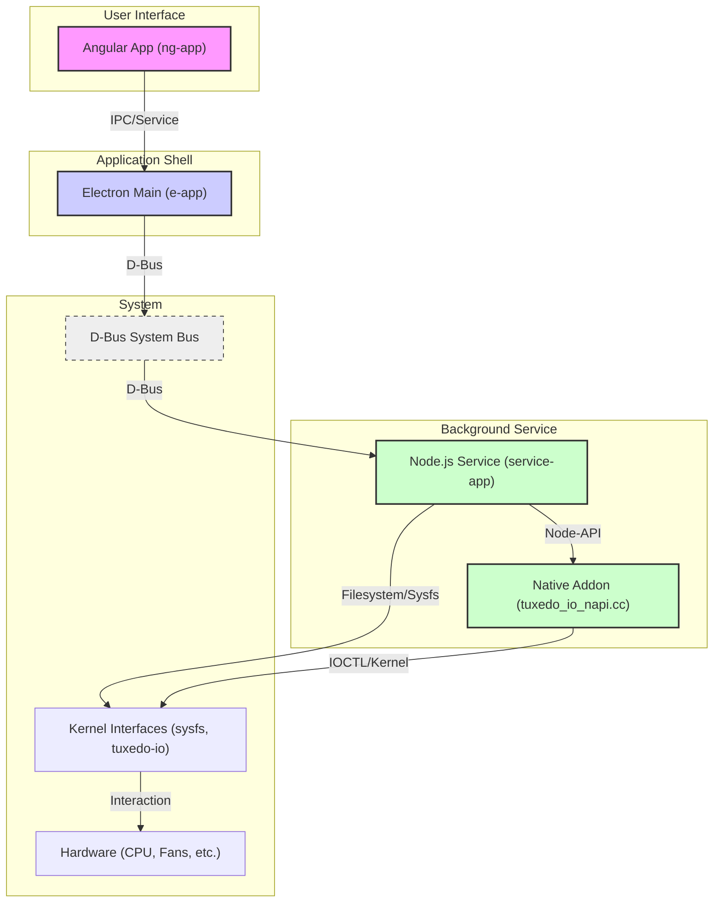
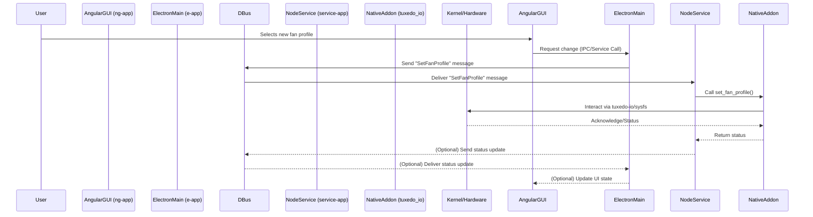

# TUXEDO Control Center (TCC) Workspace Summary

This document provides a high-level overview of the TUXEDO Control Center application's architecture and typical sequence flow based on the project structure and configuration files.

## Overview

TUXEDO Control Center (TCC) is an application designed for TUXEDO laptops, allowing users to monitor and control various hardware aspects like CPU performance, fan speeds, keyboard backlights, and power profiles.

It consists of three main parts:
1.  An Angular-based graphical user interface (GUI).
2.  An Electron application shell that hosts the GUI and manages system interactions.
3.  A background Node.js service (daemon) that performs privileged operations and interacts directly with hardware via a native C++ addon.

Communication between the Electron app and the background service is handled via D-Bus.

## Project Structure

*   `src/ng-app`: Contains the Angular frontend code (Renderer Process).
*   `src/e-app`: Contains the Electron main process code.
*   `src/service-app`: Contains the Node.js background service code (Daemon).
*   `src/common`: Shared TypeScript code (classes, models) used across different parts.
*   `src/native-lib`: Native C++ addon for low-level hardware interaction (using Node-API).
*   `src/dist-data`: Files needed for packaging (service files, icons, metadata).
*   `build-src`: Scripts and code related to the build process.

## Architecture Diagram

**Components:**

*   **Angular App:** The user-facing interface built with Angular.
*   **Electron Main:** Manages the application lifecycle, windows, and communication.
*   **Node.js Service:** Runs in the background with necessary permissions, handles hardware logic.
*   **Native Addon:** C++ module providing direct hardware access functions to the Node.js service.
*   **D-Bus:** Message bus used for communication between the Electron app and the background service.
*   **Kernel Interfaces:** Standard Linux mechanisms (`sysfs`, `ioctl`) for hardware interaction, including the specific `tuxedo-io` module.

## Sequence Diagram (Example: Changing Fan Profile)

This flow illustrates how a user action in the GUI propagates through the Electron main process, D-Bus, the background service, and the native addon to ultimately affect the hardware settings.