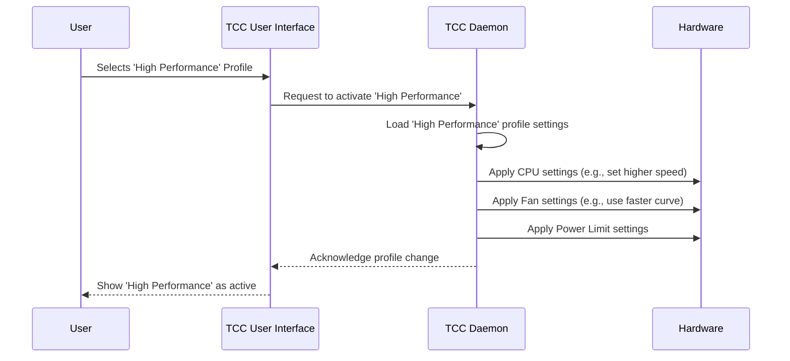

# Chapter 1: TccProfile (Performance Profiles)

Welcome to the TUXEDO Control Center (TCC) developer tutorial! We're excited to guide you through the different parts of this project.

Imagine your TUXEDO laptop is like a car. Just like a car might have different driving modes – "Eco" for saving fuel, "Comfort" for a smooth ride, or "Sport" for maximum speed – your laptop can also operate in different "modes" to suit what you're doing. In TCC, we call these modes **Performance Profiles**, or `TccProfile` in the code.

This chapter will introduce you to these Performance Profiles: what they are, why they're useful, and how TCC uses them.

## What is a Performance Profile (`TccProfile`)?

Think of a Performance Profile as a **blueprint** or a **recipe** that tells your laptop how to behave. It's a collection of settings that define things like:

*   **CPU Speed:** How fast should the processor run? Faster means more performance but uses more power.
*   **Fan Speed:** How fast should the fans spin? Faster fans cool better but can be noisier. Profiles often define "fan curves" – rules for how fan speed increases with temperature.
*   **Display Brightness:** How bright should the screen be? Brighter is easier to see but uses more battery.
*   **Power Limits:** How much power (in Watts) should the CPU and GPU be allowed to draw?
*   ...and other hardware settings like webcam status or keyboard backlight (though not all settings are in every profile).

Essentially, a profile bundles together a specific configuration for your laptop's hardware.

In the code, this blueprint is represented by a data structure, often defined using an interface called `ITccProfile`. We'll look at a simplified version later.

## Why Do We Need Different Profiles?

You don't always need your laptop running at full blast, nor do you always want it whisper-quiet at the cost of speed. Profiles let you easily switch between configurations optimized for different situations:

*   **On the Go (Battery Saving):** When you're using battery power, you might want a profile that dims the screen, slows down the CPU slightly, and keeps the fans quiet. This helps your battery last much longer. TCC might have a "Max Energy Save" profile for this.
*   **Intensive Tasks (High Performance):** If you're gaming, video editing, or running complex calculations, you'll want maximum power. A "High Performance" profile would crank up the CPU speed, allow higher power limits, and run the fans faster to keep things cool.
*   **Everyday Use (Balanced):** For web browsing, writing documents, or watching videos, you might want a balance between good performance, reasonable battery life, and low noise. An "Office" or "Quiet" profile often fits this need.
*   **Quiet Environments (Silent):** In a library or meeting, fan noise is undesirable. A "Quiet" profile would prioritize keeping the fans off or spinning very slowly, even if it means slightly limiting performance.

Profiles give you the flexibility to optimize your laptop's behavior with just a click!

## Default vs. Custom Profiles

TUXEDO Control Center comes with several **Default Profiles** pre-configured by TUXEDO Computers. These are designed to work well for common scenarios on your specific laptop model. Examples include:

*   `Max Energy Save`
*   `Quiet`
*   `Office`
*   `High Performance`

You can see the definitions for these in files like `src/common/models/DefaultProfiles.ts`.

```typescript
// Simplified view from src/common/models/DefaultProfiles.ts
export enum DefaultProfileIDs {
    MaxEnergySave = '__profile_max_energy_save__',
    Quiet = '__profile_silent__',
    Office = '__office__',
    HighPerformance = '__high_performance__',
}

// ... definition for 'MaxEnergySave' might look something like:
const maxEnergySave: ITccProfile = {
    id: DefaultProfileIDs.MaxEnergySave,
    name: "Max Energy Save", // User-visible name later
    description: "Prioritizes battery life above all else.",
    display: {
        brightness: 40, // Lower brightness
        useBrightness: true,
        // ... other display settings
    },
    cpu: {
        governor: 'powersave', // Use a power-saving CPU mode
        noTurbo: true, // Maybe disable CPU turbo boost
        // ... other CPU settings
    },
    fan: {
        fanProfile: 'Silent', // Use the quietest fan curve
        // ... other fan settings
    },
    // ... other sections
};
```

*This code snippet shows how a default profile like `MaxEnergySave` is defined internally. It has an ID, a name, and specific settings for display, CPU, fans, etc.*

But what if the defaults aren't *exactly* what you want? That's where **Custom Profiles** come in! TCC allows you to:

1.  **Create** a new profile from scratch (usually starting with default values).
2.  **Copy** an existing profile (either default or custom) and modify it.
3.  **Edit** your custom profiles.
4.  **Delete** custom profiles you no longer need.
5.  **Import/Export** your custom profiles to share them or back them up.

These custom profiles are saved separately from the defaults.

## How TCC Uses Profiles

So, you have these profile blueprints. How do they actually *do* anything?

1.  **Loading:** When TUXEDO Control Center starts, a background service called the [TuxedoControlCenterDaemon (tccd)](04_tuxedocontrolcenterdaemon__tccd_.md) reads both the default profiles and any custom profiles you've created. These are often loaded from configuration files managed by the [Configuration Handling (ConfigHandler)](06_configuration_handling__confighandler_.md).
2.  **Activation:** At any time, one profile is considered the "active" profile.
3.  **Applying Settings:** The `tccd` daemon takes the settings from the *active* profile and applies them to the actual hardware (e.g., tells the system to change CPU speed, adjusts fan controllers, sets screen brightness).
4.  **Switching:** The active profile can be changed in two main ways:
    *   **Manually:** You can use the TCC application window ([Angular Frontend (ng-app)](02_angular_frontend__ng_app_.md)) to select which profile you want to use.
    *   **Automatically:** TCC can be configured to automatically switch profiles based on system events. A common example is switching to a power-saving profile when you unplug the AC adapter and switching back to a more performant one when you plug it back in.

Here’s a simple diagram showing the flow:



*This diagram shows a user selecting a profile in the UI. The UI tells the daemon, which then loads the profile's settings and applies them to the hardware.*

## A Peek Inside a Profile (`ITccProfile`)

Let's look at a simplified structure of what a `TccProfile` object might contain in the code. This is based on the `ITccProfile` interface found in `src/common/models/TccProfile.ts`.

```typescript
// Simplified structure based on ITccProfile
interface ITccProfile {
    id: string; // Unique identifier (e.g., '__profile_max_energy_save__')
    name: string; // Human-readable name (e.g., "Max Energy Save")
    description: string; // Optional description

    // Display Settings
    display: {
        brightness: number; // Brightness percentage (0-100)
        useBrightness: boolean; // Should this profile control brightness?
        refreshRate: number; // Screen refresh rate (e.g., 60, 120 Hz) or -1 for default
        useRefRate: boolean; // Should this profile control refresh rate?
        // ... maybe resolution settings
    };

    // CPU Settings
    cpu: {
        scalingMinFrequency: number; // Minimum CPU speed (in kHz) or undefined
        scalingMaxFrequency: number; // Maximum CPU speed (in kHz) or undefined
        governor: string; // CPU frequency scaling mode (e.g., 'powersave', 'performance')
        energyPerformancePreference: string; // Hint to the CPU ('power', 'balance_performance', etc.)
        noTurbo: boolean; // Disable CPU Turbo Boost?
        // ... maybe online core count
    };

    // Fan Control Settings
    fan: {
        useControl: boolean; // Should this profile manage fans?
        fanProfile: string; // Name of a predefined fan curve (e.g., 'Silent', 'Balanced') OR 'Custom'
        minimumFanspeed: number; // Minimum allowed fan speed (%)
        maximumFanspeed: number; // Maximum allowed fan speed (%)
        customFanCurve: ITccFanProfile; // Detailed points for a custom fan curve if fanProfile is 'Custom'
    };

    // Other hardware sections like webcam, power limits (odmProfile, odmPowerLimits, nvidiaPowerCTRLProfile)...
    odmProfile?: { name: string; }; // Vendor-specific profile name (e.g., 'power_save')
    odmPowerLimits?: { tdpValues: number[]; }; // CPU/GPU Power Limits (Watts)
    nvidiaPowerCTRLProfile?: { cTGPOffset: number; }; // NVIDIA GPU power offset (Watts)
}
```

*This interface defines the structure of a profile. Each profile has sections for different hardware components like `display`, `cpu`, and `fan`, each containing specific settings and a flag (`use...`) to enable/disable control.*

## Managing Profiles in TCC

The main TCC application window provides a dedicated section, often called "Profile Manager", for handling your performance profiles. This part of the user interface is built using Angular and is covered in more detail in the [Angular Frontend (ng-app)](02_angular_frontend__ng_app_.md) chapter.

Here, you can typically:

*   **See a list** of all available profiles (both default and custom).
*   **Select** a profile to view its detailed settings.
*   **Activate** a specific profile for different states (like "On AC Power" or "On Battery").
*   Use buttons to **Create**, **Copy**, **Edit** (custom only), **Delete** (custom only), **Import**, and **Export** profiles.

The code behind this UI interacts with services that manage the profile data. For example, to create a copy of a profile:

```typescript
// Simplified from src/ng-app/app/profile-manager/profile-manager.component.ts

// Function called when the user clicks 'Copy' on a profile
public async copyProfile(profileIdToCopy: string) {
    // 1. Ask the user for a name for the new profile
    const newProfileName = await this.askUserForNewName(); // Simplified pseudo-code

    if (newProfileName) {
        // 2. Tell the configuration service to actually perform the copy
        //    This service handles creating the new profile data based on the old one.
        const newProfileId = await this.config.copyProfile(profileIdToCopy, newProfileName);

        // 3. If successful, navigate the UI to show the new profile
        if (newProfileId) {
            this.router.navigate(['profile-manager', newProfileId], /* ... */);
        }
    }
    // ... handle errors ...
}
```

*This simplified function shows the steps when copying a profile: get a new name, ask the backend/service (`this.config`) to do the copying, and then update the UI.*

When editing a profile, you might change values using sliders or input fields. The code updates the profile data being edited:

```typescript
// Simplified from src/ng-app/app/profile-details-edit/profile-details-edit.component.ts

// Function called when the brightness slider value changes
public inputDisplayBrightnessChange(newValue: number) {
    // 1. Update the temporary profile data in the form
    this.profileFormGroup.patchValue({
        display: { brightness: newValue }
    });
    this.profileFormGroup.markAsDirty(); // Mark that changes have been made

    // 2. (Optional) Apply the brightness change immediately for preview
    if (!this.dbus.displayBrightnessNotSupported) {
        this.dbus.setDisplayBrightness(newValue);
    }

    // User still needs to click "Save" to make the change permanent in the profile file.
}
```

*This snippet shows how changing a slider updates the profile data in the UI's form and might even apply the change live (like brightness) via a service (`this.dbus`). Saving the profile permanently happens later.*

## Where Are Custom Profiles Stored?

Default profiles are part of the TCC application code itself. But your custom profiles need to be saved somewhere persistent on your computer.

TCC typically stores custom profiles in configuration files, usually in JSON format. JSON (JavaScript Object Notation) is a human-readable text format that's great for storing structured data like our profiles.

A custom profile file (`profiles.json`, for example) might look something like this (simplified):

```json
[
  {
    "id": "myCustomGamingProfile123",
    "name": "My Gaming Profile",
    "description": "Optimized for high FPS!",
    "display": {
      "brightness": 80,
      "useBrightness": false,
      "refreshRate": -1,
      "useRefRate": false
    },
    "cpu": {
      "scalingMinFrequency": 1800000,
      "scalingMaxFrequency": 4500000,
      "governor": "performance",
      "energyPerformancePreference": "performance",
      "noTurbo": false
    },
    "fan": {
      "useControl": true,
      "fanProfile": "Balanced",
      "minimumFanspeed": 20,
      "maximumFanspeed": 100
    },
    "odmProfile": { "name": "overboost" },
    "odmPowerLimits": { "tdpValues": [50, 65, 75] }
  }
]
```

*This JSON example shows how a custom profile might be stored on disk. It mirrors the structure of the `ITccProfile` interface.*

Reading and writing these configuration files is handled by a dedicated part of TCC, which we'll explore in the [Configuration Handling (ConfigHandler)](06_configuration_handling__confighandler_.md) chapter.

## Conclusion

Performance Profiles (`TccProfile`) are fundamental to TUXEDO Control Center. They act as blueprints, defining how your laptop's hardware should behave to balance performance, battery life, and fan noise.

You've learned:

*   What profiles are (like car driving modes).
*   Why they are useful (optimizing for different scenarios).
*   The difference between default and custom profiles.
*   How TCC's daemon loads and applies the active profile.
*   A basic overview of the profile data structure (`ITccProfile`).
*   How profiles are managed in the UI and stored in configuration files.

Understanding profiles is key to understanding how TCC controls your laptop.

Now that you know *what* these profiles are, let's dive into the application you use to interact with them. In the next chapter, we'll explore the user interface: [Angular Frontend (ng-app)](02_angular_frontend__ng_app_.md).

---

Generated by [AI Codebase Knowledge Builder](https://github.com/The-Pocket/Tutorial-Codebase-Knowledge)