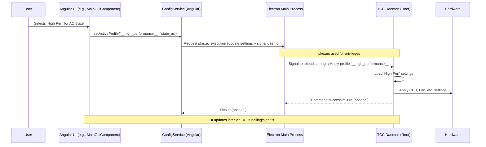

# Chapter 2: Angular Frontend (ng-app)

Welcome back! In [Chapter 1: TccProfile (Performance Profiles)](01_tccprofile__performance_profiles_.md), we learned about the different performance blueprints (`TccProfile`) that TUXEDO Control Center (TCC) uses to manage your laptop's hardware settings. But how do *you*, the user, actually see which profile is active or choose a different one? That's where the user interface comes in!

This chapter explores the **Angular Frontend**, often referred to as `ng-app` in the codebase. Think of it as the driver's seat of your TUXEDO laptop – the dashboard you look at and the controls you use.

## What Problem Does the Frontend Solve?

Imagine you have these powerful performance profiles, but no way to interact with them. How would you know if your laptop is currently saving battery or running at full speed? How would you switch to your "Gaming" profile before launching a demanding game?

The `ng-app` solves this by providing a **visual and interactive layer**. Its main jobs are:

1.  **Displaying Information:** Show current hardware status (like CPU temperature, fan speed) and TCC settings (like the active profile).
2.  **Allowing Configuration:** Let you change settings, manage your custom profiles (create, edit, delete), and select which profile to use for different situations (like AC power vs. battery).
3.  **Triggering Actions:** Provide buttons and controls to activate profiles or change specific settings immediately.

**Use Case Example:** Let's say you want to check your current CPU temperature and then switch from the default "Office" profile to your custom "High Performance" profile because you're about to edit a video. The `ng-app` is the part of TCC that makes this possible with just a few clicks.

## Key Concepts of the Angular Frontend

TCC's user interface is built using a popular web development framework called **Angular**. Even though TCC is a desktop application, Angular helps organize the UI code effectively. Here are a few core ideas:

*   **What is Angular?** It's a toolkit for building user interfaces. Think of it like a set of pre-made components and rules (like Lego bricks and instructions) that help developers build complex applications faster and keep the code organized. In TCC, it builds the window you see and interact with.
*   **Components:** These are the building blocks of the UI. A button, a dropdown menu, a dashboard panel showing CPU info – each of these visual elements can be an Angular component. They package the look (HTML), the behavior (TypeScript code), and styling (CSS) together. You'll find components in `src/ng-app/app/` like `cpu-dashboard.component.ts` or `profile-manager.component.ts`.
*   **Templates (HTML):** Each component has an HTML template that defines its structure. It's like the blueprint for what the component looks like. It uses standard HTML tags (`<div>`, `<button>`) plus special Angular syntax to display data or handle user input. See files like `cpu-dashboard.component.html`.
*   **Services:** These are responsible for tasks that aren't directly tied to a specific visual component. They often handle:
    *   Fetching data (e.g., getting the list of profiles).
    *   Sharing data between components.
    *   Communicating with the "outside world" (like the TCC daemon).
    Examples include `ConfigService` (`src/ng-app/app/config.service.ts`) for managing profiles and settings, and `TccDBusClientService` (`src/ng-app/app/tcc-dbus-client.service.ts`) for talking to the background daemon via DBus.
*   **Data Binding:** This is Angular's magic for keeping the UI and the application's data in sync.
    *   **Displaying Data:** When the `TccDBusClientService` gets the latest CPU temperature from the daemon, data binding automatically updates the temperature display in the `CpuDashboardComponent`.
    *   **Handling Input:** When you click the "Activate" button for a profile, data binding helps trigger the correct function in the component's code.
*   **Routing:** TCC isn't just one screen. It has different sections like "Dashboard", "Profile Manager", "Settings", etc. Angular Routing handles navigating between these views. The file `src/ng-app/app/app-routing.module.ts` defines which component to show for which URL path within the app.

## How the Frontend Solves Our Use Case

Let's revisit our example: *Check CPU temperature and switch to 'High Performance' profile.*

1.  **Checking Temperature:**
    *   The [TuxedoControlCenterDaemon (tccd)](04_tuxedocontrolcenterdaemon__tccd_.md) constantly monitors hardware sensors.
    *   It makes this data available via [DBus Communication (TccDBusService / TccDBusController)](05_dbus_communication__tccdbusservice___tccdbuscontroller_.md).
    *   In the `ng-app`, the `TccDBusClientService` periodically asks the DBus service for the latest sensor data.
    *   It stores this data (like CPU temp) in variables.
    *   The `CpuDashboardComponent` uses `TccDBusClientService` to get the temperature.
    *   Angular's data binding automatically displays this temperature value in the dashboard's HTML template (`cpu-dashboard.component.html`).

2.  **Switching Profile:**
    *   You navigate to the "Profile Manager" view (using Angular Routing).
    *   The `ProfileManagerComponent` uses the `ConfigService` to get the list of available profiles (default and custom).
    *   The component's HTML template (`profile-manager.component.html`) displays this list.
    *   You find your "High Performance" profile and click its "Activate" button (or select it for the current state, e.g., "On AC Power").
    *   Clicking the button triggers a function in `ProfileManagerComponent` (or `MainGuiComponent` for state selection).
    *   This function calls a method in the `ConfigService`, like `setActiveProfile()`.
    *   The `ConfigService` doesn't directly change hardware. Instead, it sends a command (often via the [Electron Main Process (e-app)](03_electron_main_process__e_app_.md) or directly using `pkexec`) to the `tccd` daemon, telling it to activate the "High Performance" profile.
    *   The `tccd` daemon receives the request, loads the profile settings, and applies them to the hardware.
    *   The `TccDBusClientService` eventually gets notified (or polls) that the active profile has changed, and the UI updates to reflect this.

## Under the Hood: How It Works

Let's trace the flow when you click to activate a profile for the "On AC Power" state in the main UI dropdown:

1.  **User Action:** You click on the dropdown menu for the "On AC Power" state in the main window's sidebar and select the "High Performance" profile.
2.  **Angular Component:** The `MainGuiComponent` (`src/ng-app/app/main-gui/main-gui.component.ts`) handles this selection change. It knows the ID of the selected profile ("High Performance") and the state ID ("On AC Power").
3.  **Config Service:** The component calls a method like `config.setActiveProfile('__high_performance__', 'state_ac')` in the `ConfigService` (`src/ng-app/app/config.service.ts`).
4.  **Privilege Escalation & Daemon Communication:** The `ConfigService.setActiveProfile` method needs root privileges to tell the daemon to change system settings. It often uses `pkexec` (a tool to run commands as another user, usually root) to execute a command that modifies the TCC settings file and signals the `tccd` daemon. This might involve the [Electron Main Process (e-app)](03_electron_main_process__e_app_.md) to help run the `pkexec` command.
5.  **Daemon Action:** The `tccd` daemon ([TuxedoControlCenterDaemon (tccd)](04_tuxedocontrolcenterdaemon__tccd_.md)) detects the settings change (or receives a signal), loads the "High Performance" profile settings, and applies them to the hardware (CPU, fans, etc.).
6.  **UI Update:** The `TccDBusClientService` periodically fetches the current settings and active profile from the daemon via DBus. When it sees the active profile for the AC state has changed, it updates its internal data. Components observing this data (like `MainGuiComponent`) automatically update via Angular's data binding to show "High Performance" as the selected profile for the AC state.

Here's a simplified diagram of that flow:



*This diagram shows the user interaction triggering a call chain from the Angular UI Component, through the ConfigService, potentially involving the Electron Main process to execute privileged commands, finally reaching the TCCD daemon which applies changes to the hardware.*

### Code Snippets

Let's look at some simplified code examples:

**1. Defining Routes (`app-routing.module.ts`)**

This file tells Angular which component to display for different "pages" within the app.

```typescript
// Simplified from src/ng-app/app/app-routing.module.ts
import { NgModule } from "@angular/core";
import { Routes, RouterModule } from "@angular/router";

import { ProfileManagerComponent } from "./profile-manager/profile-manager.component";
import { CpuDashboardComponent } from "./cpu-dashboard/cpu-dashboard.component";
import { MainGuiComponent } from "./main-gui/main-gui.component";
// ... other imports

const routes: Routes = [
    // Default route redirects to the dashboard inside the main layout
    { path: "", redirectTo: "/main-gui/cpu-dashboard", pathMatch: "full" },
    {
        path: "main-gui", // The main layout component
        component: MainGuiComponent,
        children: [ // Child routes are displayed inside MainGuiComponent
            { path: "profile-manager", component: ProfileManagerComponent },
            { path: "cpu-dashboard", component: CpuDashboardComponent },
            // ... other routes like 'global-settings', 'support', 'info'
        ],
    },
    // ... other top-level routes if needed
];

@NgModule({
    imports: [RouterModule.forRoot(routes, { useHash: true })], // useHash is common for Electron apps
    exports: [RouterModule],
})
export class AppRoutingModule {}
```

*This code defines the navigation structure. Accessing the app leads to `/main-gui/cpu-dashboard`, showing the `MainGuiComponent` containing the `CpuDashboardComponent`.*

**2. Displaying Data in a Component Template (`cpu-dashboard.component.html`)**

This template uses Angular's double curly braces `{{ }}` for data binding to display values from the component's code.

```html
<!-- Simplified from src/ng-app/app/cpu-dashboard.component.html -->
<mat-card>
  <mat-card-header>
    <mat-card-title i18n="@@dashboardCPUTitle">CPU Information</mat-card-title>
  </mat-card-header>
  <mat-card-content>
    <!-- Display CPU temperature -->
    <div *ngIf="compat.hasCpuTemp"> <!-- Only show if compatible -->
      <span i18n="@@dashboardCpuTemp">Temperature:</span>
      <!-- The 'gaugeCpuTempFormat' function formats the value -->
      <strong>{{ gaugeCpuTempFormat(fanData?.cpu?.temp?.data?.value) }} °{{ getUsingFahrenheit() ? 'F' : 'C' }}</strong>
    </div>

    <!-- Display Average CPU Frequency -->
    <div>
      <span i18n="@@dashboardAvgCPUFreq">Average Frequency:</span>
      <!-- 'formatCpuFrequency' formats the raw value -->
      <strong>{{ formatCpuFrequency(avgCpuFreq) }}</strong>
    </div>

    <!-- Display Active Profile Name -->
    <div *ngIf="activeProfile"> <!-- Only show if profile data is loaded -->
        <span i18n="@@dashboardActiveProfile">Active Profile:</span>
        <strong>{{ activeProfile.name }}</strong>
        <!-- Link to edit the profile -->
        <button mat-icon-button [routerLink]="['/main-gui/profile-manager', activeProfile.id]">
            <mat-icon>edit</mat-icon>
        </button>
    </div>
  </mat-card-content>
</mat-card>
```

*This HTML snippet shows how data like CPU temperature (`fanData?.cpu?.temp?.data?.value`) and the active profile name (`activeProfile.name`) are displayed using data binding `{{ }}`. `*ngIf` conditionally shows elements, and `[routerLink]` creates navigation links.*

**3. Component Logic (`cpu-dashboard.component.ts`)**

The component's TypeScript file fetches data from services and provides properties and methods for the template.

```typescript
// Simplified from src/ng-app/app/cpu-dashboard/cpu-dashboard.component.ts
import { Component, OnInit, OnDestroy } from "@angular/core";
import { TccDBusClientService, IDBusFanData } from "../tcc-dbus-client.service";
import { StateService } from "../state.service";
import { ITccProfile } from "src/common/models/TccProfile";
import { Subscription } from "rxjs";
import { CompatibilityService } from "../compatibility.service"; // Checks hardware support
import { ConfigService } from "../config.service";

@Component({
    selector: "app-cpu-dashboard",
    templateUrl: "./cpu-dashboard.component.html",
    // ... styles
})
export class CpuDashboardComponent implements OnInit, OnDestroy {
    fanData: IDBusFanData; // Holds data from DBus (temps, fan speeds)
    activeProfile: ITccProfile; // Holds the currently active profile object
    avgCpuFreq: number = 0; // Calculated average frequency

    private subscriptions = new Subscription();

    // Services are 'injected' by Angular's dependency injection
    constructor(
        private tccdbus: TccDBusClientService,
        private state: StateService,
        public compat: CompatibilityService, // public so template can access it
        private config: ConfigService
    ) {}

    ngOnInit(): void {
        // Subscribe to updates from the DBus service for fan/temp data
        this.subscriptions.add(
            this.tccdbus.fanData.subscribe(data => {
                this.fanData = data;
                // Maybe calculate avgCpuFreq here based on other data
            })
        );
        // Subscribe to updates for the active profile
        this.subscriptions.add(
            this.state.activeProfile.subscribe(profile => {
                this.activeProfile = profile;
            })
        );
        // ... fetch other data ...
    }

    // Function called by the template to format CPU frequency
    formatCpuFrequency(freq: number): string {
        // ... implementation using utils service ...
        return freq ? (freq / 1000000).toFixed(2) + ' GHz' : 'N/A';
    }

    // Function called by template to check temperature unit
    getUsingFahrenheit(): boolean {
        return this.config.getSettings()?.fahrenheit ?? false;
    }

    ngOnDestroy(): void {
        this.subscriptions.unsubscribe(); // Clean up subscriptions
    }
}
```

*This code shows how the component subscribes (`.subscribe`) to data streams from services (`tccdbus`, `state`) and stores the results in properties (`this.fanData`, `this.activeProfile`) that the HTML template can then display. It also defines helper functions like `formatCpuFrequency`.*

**4. Service for DBus Communication (`tcc-dbus-client.service.ts`)**

This service is responsible for interacting with the TCC daemon via DBus.

```typescript
// Simplified from src/ng-app/app/tcc-dbus-client.service.ts
import { Injectable, OnDestroy } from '@angular/core';
import { TccDBusController } from '../../common/classes/TccDBusController';
import { BehaviorSubject } from 'rxjs'; // For reactive data streams
import { FanData } from '../../service-app/classes/TccDBusInterface';
import { ITccProfile } from '../../common/models/TccProfile';

// Define structure for fan data BehaviorSubject
export interface IDBusFanData { cpu: FanData; gpu1: FanData; gpu2: FanData; }

@Injectable({ providedIn: 'root' }) // Available app-wide
export class TccDBusClientService implements OnDestroy {
  private tccDBusInterface: TccDBusController;
  private intervalId: NodeJS.Timeout;

  // BehaviorSubject holds the current value and notifies subscribers of changes
  public fanData = new BehaviorSubject<IDBusFanData>({ /* initial empty data */ });
  public activeProfile = new BehaviorSubject<ITccProfile>(undefined);
  // ... other BehaviorSubjects for settings, capabilities, etc.

  constructor() {
    this.tccDBusInterface = new TccDBusController();
    this.initAndUpdate(); // Initialize connection and start updates
  }

  private async initAndUpdate() {
    await this.tccDBusInterface.init(); // Connect to DBus service
    this.periodicUpdate(); // Start polling for data
    this.intervalId = setInterval(() => this.periodicUpdate(), 1000); // Poll every second
  }

  private async periodicUpdate() {
    if (!await this.tccDBusInterface.dbusAvailable()) return;

    // Fetch data from DBus
    const cpuFan = await this.tccDBusInterface.getFanDataCPU();
    // ... fetch gpu1Fan, gpu2Fan ...
    this.fanData.next({ cpu: cpuFan, /* gpu1, gpu2 */ }); // Update the stream

    const activeProfileJson = await this.tccDBusInterface.getActiveProfileJSON();
    if (activeProfileJson) {
        this.activeProfile.next(JSON.parse(activeProfileJson)); // Update stream
    }
    // ... fetch and update other data streams ...
  }

  ngOnDestroy() {
    clearInterval(this.intervalId); // Stop polling
    this.tccDBusInterface.disconnect();
  }

  // Methods to send commands (simplified - actual commands might be different)
  async setDisplayBrightness(value: number): Promise<void> {
      await this.tccDBusInterface.setDisplayBrightness(value);
  }
}
```

*This service uses `TccDBusController` to talk to the daemon. It uses `BehaviorSubject` to create reactive data streams (`fanData`, `activeProfile`). The `periodicUpdate` method fetches data regularly and pushes it into these streams using `.next()`. Components subscribe to these streams to get live updates.*

**5. Service for Configuration (`config.service.ts`)**

This service manages loading, saving, and modifying profiles and application settings.

```typescript
// Simplified from src/ng-app/app/config.service.ts
import { Injectable } from '@angular/core';
import { ITccSettings } from '../../common/models/TccSettings';
import { ITccProfile, generateProfileId } from '../../common/models/TccProfile';
import { TccDBusClientService } from './tcc-dbus-client.service';
import { ElectronService } from 'ngx-electron'; // For IPC communication

@Injectable({ providedIn: 'root' })
export class ConfigService {
    private settings: ITccSettings;
    private customProfiles: ITccProfile[];

    constructor(
        private dbus: TccDBusClientService,
        private electron: ElectronService // To interact with Electron main process
    ) {
        // Load initial data from DBus service (which gets it from daemon)
        this.dbus.settings.subscribe(s => this.settings = s);
        this.dbus.customProfiles.subscribe(p => this.customProfiles = p);
    }

    getSettings(): ITccSettings {
        return this.settings;
    }

    getCustomProfiles(): ITccProfile[] {
        return this.customProfiles;
    }

    // Method to change the active profile for a state (e.g., AC/Battery)
    setActiveProfile(profileId: string, stateId: string): void {
        // Prepare arguments for the privileged command
        const tccdExec = '/usr/bin/tccd'; // Path to daemon executable
        const tmpSettingsPath = '/tmp/tmptccsettings';
        // ... (Code to write new settings temporarily to tmpSettingsPath) ...

        // Use Electron's IPC to ask the main process to run pkexec
        // This requires root password the first time
        const command = `pkexec ${tccdExec} --new_settings ${tmpSettingsPath}`;
        this.electron.ipcRenderer.sendSync('exec-cmd-sync', command);

        // Trigger a refresh of data from the daemon
        this.dbus.triggerUpdate();
    }

    // Method to save changes to a custom profile
    async saveCustomProfile(profile: ITccProfile): Promise<boolean> {
        // Find the profile index
        const index = this.customProfiles.findIndex(p => p.id === profile.id);
        if (index === -1) return false; // Profile not found

        const updatedProfiles = [...this.customProfiles]; // Create a copy
        updatedProfiles[index] = profile; // Update the profile in the copy

        // Write the updated list to a temporary file
        const tmpProfilesPath = '/tmp/tmptccprofiles';
        // ... (Code to write updatedProfiles to tmpProfilesPath) ...

        // Ask Electron main process to run pkexec to update the profiles file
        const tccdExec = '/usr/bin/tccd';
        const command = `pkexec ${tccdExec} --new_profiles ${tmpProfilesPath}`;
        const result = await this.electron.ipcRenderer.invoke('exec-cmd-async', command);

        if (result.success) {
            this.dbus.triggerUpdate(); // Refresh data
            return true;
        } else {
            // Handle error (show message to user, etc.)
            return false;
        }
    }
}
```

*This service holds configuration data received via the `TccDBusClientService`. Crucially, when modifications are needed (like `setActiveProfile` or saving a custom profile), it prepares the necessary command and uses the `ElectronService` to request the [Electron Main Process (e-app)](03_electron_main_process__e_app_.md) to execute it with root privileges via `pkexec`. It then triggers a data refresh.*

## Conclusion

The Angular Frontend (`ng-app`) is the face of TUXEDO Control Center. It's the part you directly see and interact with. Built with Angular, it uses components, services, and data binding to:

*   Display real-time information fetched from the TCC daemon via DBus.
*   Provide controls for managing performance profiles and other settings.
*   Trigger actions by sending requests (often requiring elevated privileges) back to the daemon, usually with the help of the Electron main process.

You've now seen how profiles are defined ([Chapter 1](01_tccprofile__performance_profiles_.md)) and how the user interacts with them via the UI (this chapter). But how does the UI actually run as a desktop application, and how does it handle things like running commands with root privileges?

In the next chapter, we'll look at the layer that wraps our Angular web application and turns it into a desktop app: the [Electron Main Process (e-app)](03_electron_main_process__e_app_.md).

---

Generated by [AI Codebase Knowledge Builder](https://github.com/The-Pocket/Tutorial-Codebase-Knowledge)