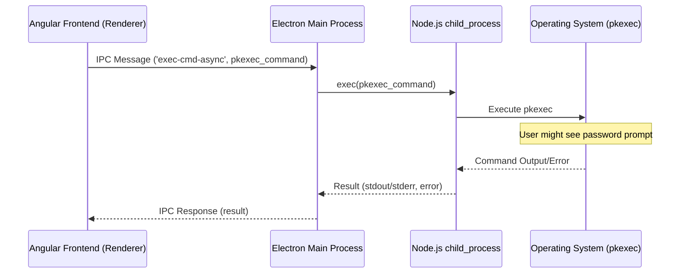

# Chapter 3: Electron Main Process (e-app)

Welcome back! In [Chapter 2: Angular Frontend (ng-app)](02_angular_frontend__ng_app_.md), we explored the user interface of TUXEDO Control Center (TCC) – the dashboard and controls you interact with, built using Angular. You might have wondered: how does this web-based UI become a real desktop application that can interact with my operating system? How can it do things like show system notifications, manage application windows, or run commands that need special permissions?

That's where the **Electron Main Process**, or `e-app`, comes in! Think of it as the **stage manager** for our TCC application "theater". While the Angular frontend is the actor performing on stage (the visible window), the `e-app` works backstage, setting up the stage, managing the lights and sound (OS interactions), and ensuring the whole show runs smoothly.

## What Problem Does the Electron Main Process Solve?

Web applications (like our Angular frontend) normally run inside a web browser and are quite limited in what they can do on your computer. They can't easily access files outside their designated area, manage system power settings, or create native desktop features like tray icons.

Electron solves this by wrapping the web application (HTML, CSS, JavaScript/TypeScript) inside a native desktop application shell. This shell consists of two main parts:

1.  **Main Process (`e-app`):** The backend manager we're discussing in this chapter. It runs in a Node.js environment, giving it full access to the operating system's capabilities (within the user's permissions, or requesting elevated permissions when needed).
2.  **Renderer Process(es):** Each application window (like the main TCC window running the Angular app) runs in its own separate process. This is more like a specialized web browser environment (using Chromium). It's great at rendering the UI but has limited OS access for security reasons.

The `e-app` acts as the bridge between the user interface (running in a Renderer process) and the underlying operating system.

**Use Case Example:** Remember from Chapter 2 how saving changes to a custom profile requires administrator (root) privileges? The Angular frontend (`ng-app`) itself cannot directly run commands as root. It needs help from a process that *can* interact more deeply with the system. The `e-app` is that helper.

## Key Concepts of the Electron Main Process

*   **What is Electron?** Electron is a framework that lets developers build desktop applications using web technologies (HTML, CSS, JavaScript/TypeScript). It combines the Chromium rendering engine (what powers Google Chrome) and the Node.js runtime environment. TCC uses Electron to package the Angular frontend into a desktop app.
*   **Main Process (`e-app`):** This is the **entry point** of the Electron application (defined in `package.json`'s `"main"` field). There's only **one** Main process for the entire application. It's responsible for:
    *   **Creating Application Windows:** Using Electron's `BrowserWindow` API to create the windows where the UI (like our Angular app) will be displayed.
    *   **Managing Application Lifecycle:** Handling events like when the app starts (`ready`), when all windows are closed (`window-all-closed`), or when the app is about to quit (`will-quit`).
    *   **Creating Native UI Elements:** Managing things like the system tray icon and its context menu (`Tray` API).
    *   **Responding to OS Events:** Listening for system events like suspend/resume (`powerMonitor` API).
    *   **Providing Native OS API Access:** Offering features like file open/save dialogs (`dialog` API), system notifications, or interacting with the power save blocker (`powerSaveBlocker` API).
    *   **Inter-Process Communication (IPC):** Acting as the central hub for messages between different parts of the app (e.g., between the `ng-app` in its window and the `e-app` itself).
    *   **Executing Privileged Operations:** Using Node.js capabilities (like `child_process`) to run external commands, sometimes requesting elevation (like with `pkexec`).
*   **Renderer Process (`ng-app` runs here):** Each `BrowserWindow` created by the Main process runs its own Renderer process. This process is responsible for rendering the HTML/CSS and executing the JavaScript/TypeScript for that specific window. Our Angular application (`ng-app`) runs inside one of these Renderer processes. It has limited access to the OS and relies on **IPC** to ask the Main process for help with tasks requiring native capabilities.
*   **Inter-Process Communication (IPC):** Because the Main and Renderer processes are separate, they need a way to talk to each other. Electron provides IPC modules (`ipcMain` in the Main process, `ipcRenderer` in the Renderer process) for sending and receiving messages. This is like the stage manager (`e-app`) talking to the actor (`ng-app`) via a walkie-talkie.

## How the `e-app` Solves Our Use Case (Running `pkexec`)

Let's revisit the use case: The user edits a custom profile in the Angular frontend (`ng-app`) and clicks "Save". Saving requires writing to a system file, which needs root privileges obtained via `pkexec`.

1.  **Angular UI (`ng-app`):** The `ConfigService` in the Angular app knows it needs to run a `pkexec` command.
2.  **IPC Request (Renderer -> Main):** The `ConfigService` uses the `ElectronService` (specifically `ipcRenderer`) to send a message to the Main process (`e-app`). This message might be named something like `'exec-cmd-async'` and contains the `pkexec` command string as data.
3.  **IPC Handling (Main Process):** The `e-app` (in `src/e-app/main.ts`) has a listener set up using `ipcMain.handle('exec-cmd-async', ...)` waiting for this specific message.
4.  **Executing the Command (Main Process):** When the message arrives, the `ipcMain` handler function executes. It uses the Node.js `child_process.exec` function to run the received `pkexec` command string.
5.  **OS Interaction:** Node.js asks the operating system to execute `pkexec`. The OS then typically prompts the user for their password to grant root privileges for that command.
6.  **Getting the Result (Main Process):** Once the command finishes (or fails), `child_process.exec` returns the output (or error) to the `e-app`.
7.  **IPC Response (Main -> Renderer):** The `ipcMain` handler sends the result (success or failure, output/error message) back to the `ng-app` that originally sent the request.
8.  **Handling the Result (Angular UI):** The `ConfigService` in the `ng-app` receives the response and can now inform the user whether the save was successful or show an error message.

The `e-app` acts as a secure intermediary, allowing the less-privileged UI to request and perform actions that require higher privileges or direct OS interaction.

## Under the Hood: A Peek Inside `e-app`

Let's look at the flow and some code snippets.

### The Flow: `pkexec` via IPC



*This diagram shows the communication flow: Angular sends an IPC request, the Electron Main process receives it, uses Node.js's `child_process` to execute the command via the OS (which handles `pkexec`), gets the result back, and sends it back to Angular via IPC.*

### Code Snippets

**1. Entry Point (`package.json`)**

This file tells Electron where the Main process code lives.

```json
// Simplified from package.json
{
  "name": "tuxedo-control-center",
  "version": "2.1.16",
  // highlight-next-line
  "main": "./dist/tuxedo-control-center/e-app/e-app/main.js",
  "scripts": {
    // ... other scripts
    "start": "electron ./dist/tuxedo-control-center",
    // ...
  },
  // ... dependencies, etc.
}
```

*The `"main"` field points to the compiled JavaScript file (`main.js`) that Electron will run as the Main process when you execute `npm start` or run the built application.*

**2. Creating the Main Window (`src/e-app/main.ts`)**

The Main process creates the `BrowserWindow` where the Angular app will live.

```typescript
// Simplified from src/e-app/main.ts
import { app, BrowserWindow, screen } from 'electron';
import * as path from 'path';

let tccWindow: BrowserWindow; // Variable to hold the window object

async function createTccWindow(langId: string) {
    // Calculate window size, considering screen dimensions
    let windowWidth = 1250;
    let windowHeight = 770;
    // ... (code to adjust size based on screen.getPrimaryDisplay().workAreaSize) ...

    tccWindow = new BrowserWindow({
        title: 'TUXEDO Control Center',
        width: windowWidth,
        height: windowHeight,
        icon: path.join(__dirname, '../../data/dist-data/tuxedo-control-center_256.png'),
        webPreferences: {
            // IMPORTANT: These allow the Renderer to use Node.js APIs and talk via IPC
            nodeIntegration: true,
            contextIsolation: false,
            enableRemoteModule: true, // Note: Remote module is discouraged in newer Electron versions
        },
        show: false // Don't show immediately, wait until ready
    });

    // Load the Angular app's index.html file into the window
    const indexPath = path.join(__dirname, '..', '..', 'ng-app', langId, 'index.html');
    await tccWindow.loadFile(indexPath);

    // Handle window closure
    tccWindow.on('closed', () => {
        tccWindow = null; // Dereference the window object
    });

    // Show the window gracefully when the content is ready
    tccWindow.once('ready-to-show', () => {
        tccWindow.show();
    });
}

// Call createTccWindow when Electron is ready
app.whenReady().then(() => {
    // ... (language loading, DBus init, etc.) ...
    createTccWindow('en'); // Example: Load English version
});
```

*This code defines a function `createTccWindow` that uses Electron's `BrowserWindow` class to create a new application window. It sets options like size, title, and crucially, `webPreferences` that enable communication between the Main process and the Renderer process loading the Angular app (`loadFile`). The window is actually created once Electron signals it's ready (`app.whenReady`).*

**3. Handling IPC Messages (`src/e-app/main.ts`)**

The Main process listens for messages from Renderer processes.

```typescript
// Simplified from src/e-app/main.ts
import { ipcMain } from 'electron';
import * as child_process from 'child_process';

// Handle asynchronous messages that expect a response (using Promises)
ipcMain.handle('exec-cmd-async', async (event, commandToExecute: string) => {
    console.log(`Main Process: Received 'exec-cmd-async' for: ${commandToExecute}`);
    return new Promise((resolve) => {
        child_process.exec(commandToExecute, (error, stdout, stderr) => {
            if (error) {
                console.error(`Main Process: Error executing command: ${error.message}`);
                // Resolve with an object indicating failure and including error details
                resolve({ success: false, data: stderr, error: error });
            } else {
                console.log(`Main Process: Command executed successfully. Output: ${stdout}`);
                // Resolve with an object indicating success and including standard output
                resolve({ success: true, data: stdout, error: null });
            }
        });
    });
});

// Example of handling synchronous messages (less common, can block UI)
ipcMain.on('exec-cmd-sync', (event, commandToExecute: string) => {
    console.log(`Main Process: Received 'exec-cmd-sync' for: ${commandToExecute}`);
    try {
        const output = child_process.execSync(commandToExecute);
        event.returnValue = { success: true, data: output.toString(), error: null };
    } catch (error) {
        event.returnValue = { success: false, data: null, error: error };
    }
});
```

*This snippet shows how `ipcMain` is used. `ipcMain.handle` sets up a listener for asynchronous messages (like `'exec-cmd-async'`). When the message arrives, it executes the provided function (in this case, running the command using `child_process.exec`). It uses a `Promise` to handle the asynchronous nature of `exec` and sends the result back to the caller. `ipcMain.on` is used for synchronous messages, where the result is set on `event.returnValue`.*

**4. Sending IPC Messages from Angular (`src/ng-app/app/config.service.ts`)**

The Angular service uses `ipcRenderer` (via `ElectronService`) to send the request.

```typescript
// Simplified from src/ng-app/app/config.service.ts
import { Injectable } from '@angular/core';
import { ElectronService } from 'ngx-electron'; // Service wrapping Electron APIs for Angular

@Injectable({ providedIn: 'root' })
export class ConfigService {

    constructor(
        private electron: ElectronService // Inject the Electron service
    ) {}

    // Method to save changes to a custom profile
    async saveCustomProfile(profile: ITccProfile): Promise<boolean> {
        // ... (Code to prepare updated profile data and write to a temporary file path) ...
        const tmpProfilesPath = '/tmp/tmptccprofiles';
        // ... fs.writeFileSync(tmpProfilesPath, JSON.stringify(updatedProfiles)) ... // Needs helper/main process too!

        // Construct the command that needs root privileges
        const tccdExec = '/usr/bin/tccd'; // Path to the daemon executable
        const command = `pkexec ${tccdExec} --new_profiles ${tmpProfilesPath}`;

        console.log(`ConfigService: Sending IPC 'exec-cmd-async' for: ${command}`);

        // Check if running inside Electron before using IPC
        if (this.electron.isElectronApp) {
            try {
                // Send the command to the Main process and wait for the result
                // highlight-next-line
                const result: { success: boolean, data: string, error: any } =
                    await this.electron.ipcRenderer.invoke('exec-cmd-async', command);

                if (result.success) {
                    console.log('ConfigService: Profile save command executed successfully.');
                    // ... (trigger UI refresh) ...
                    return true;
                } else {
                    console.error('ConfigService: Profile save command failed:', result.error);
                    // ... (show error message to user) ...
                    return false;
                }
            } catch (ipcError) {
                 console.error('ConfigService: IPC error:', ipcError);
                 return false;
            }
        } else {
            console.warn('ConfigService: Not running in Electron, cannot execute command.');
            return false; // Not in Electron, cannot execute
        }
    }
}
```

*Here, the `ConfigService` uses the injected `ElectronService`. Inside `saveCustomProfile`, after preparing the command, it calls `this.electron.ipcRenderer.invoke('exec-cmd-async', command)`. This sends the message `'exec-cmd-async'` along with the `command` string to the Main process (`e-app`) and waits (`await`) for the `Promise` returned by `ipcMain.handle` to resolve with the execution result.*

**5. Creating the Tray Icon (`src/e-app/TccTray.ts`)**

The `e-app` also manages native UI elements like the tray icon.

```typescript
// Simplified conceptual structure from src/e-app/TccTray.ts and main.ts usage
import { Menu, Tray } from 'electron';
import * as path from 'path';

let trayInstance: Tray | null = null;

export function createTray() {
    const iconPath = path.join(__dirname, '../../data/dist-data/tuxedo-control-center_256.png');
    trayInstance = new Tray(iconPath);

    const contextMenu = Menu.buildFromTemplate([
        { label: 'Show TCC', click: () => { /* Code to show main window */ } },
        { label: 'Profiles', submenu: [ /* Dynamically build profile list here */ ] },
        { type: 'separator' },
        { label: 'Exit', click: () => { /* Code to quit app */ } }
    ]);

    trayInstance.setToolTip('TUXEDO Control Center');
    trayInstance.setContextMenu(contextMenu);
}

// In main.ts, after app is ready:
// import { createTray } from './TccTray';
// app.whenReady().then(() => {
//    ...
//    createTray();
//    ...
// });
```

*This shows the basic idea: The `e-app` uses Electron's `Tray` and `Menu` modules to create a system tray icon and define its right-click menu. The actual menu in TCC is more complex, dynamically listing profiles and other options by communicating with the [TuxedoControlCenterDaemon (tccd)](04_tuxedocontrolcenterdaemon__tccd_.md) via DBus (covered later).*

## Conclusion

The Electron Main Process (`e-app`) is the backbone of the TUXEDO Control Center desktop application. It's the "stage manager" that:

*   Turns the web-based Angular UI into a native desktop application using Electron.
*   Creates and manages application windows and native elements like the tray icon.
*   Handles the application's lifecycle and interaction with the operating system.
*   Provides a secure way for the UI (Renderer process) to request actions requiring OS access or elevated privileges via Inter-Process Communication (IPC).
*   Uses Node.js capabilities like `child_process` to execute external commands (like `pkexec`).

Understanding the `e-app` helps clarify how TCC bridges the gap between a user-friendly web frontend and the powerful, low-level system controls it manages.

Now that we've seen the UI (`ng-app`) and the desktop application shell (`e-app`), where do the *actual* hardware control commands happen? Who applies the profile settings? That's the job of the background service, which we'll explore next in [Chapter 4: TuxedoControlCenterDaemon (tccd)](04_tuxedocontrolcenterdaemon__tccd_.md).

---

Generated by [AI Codebase Knowledge Builder](https://github.com/The-Pocket/Tutorial-Codebase-Knowledge)