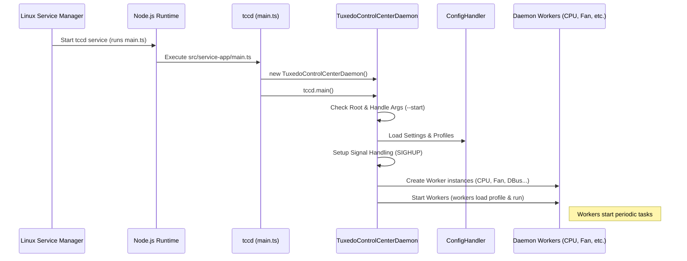

# Chapter 4: TuxedoControlCenterDaemon (tccd)

Welcome back! In [Chapter 3: Electron Main Process (e-app)](03_electron_main_process__e_app_.md), we saw how the TUXEDO Control Center (TCC) application gets packaged into a desktop app and how the user interface (UI) can ask for tasks that need special system access, like running commands with `pkexec`.

But who actually *carries out* these hardware-related tasks? When you click "Activate" on a performance profile, which part of TCC makes the CPU faster or adjusts the fan speeds? That's the job of the **TuxedoControlCenterDaemon**, or `tccd`.

Think of the `e-app` as the front office manager taking your request, but the `tccd` is the **chief engineer** down in the engine room, actually turning the dials and pulling the levers connected to the hardware. It's the heart of TCC's hardware control capabilities.

## What Problem Does the `tccd` Solve?

Imagine you set your laptop to the "High Performance" profile using the TCC window. What happens if you close that window? Should your laptop immediately slow down again? Probably not! You want the settings to stick. Also, controlling hardware like CPU speed, fan curves, or power limits often requires administrator (root) privileges, which normal applications don't have.

The `tccd` solves these problems by being a **background service** (also known as a *daemon* on Linux):

1.  **Persistence:** It runs continuously in the background, separate from the main TCC window. This means your chosen profile and settings remain active even when the UI application isn't open.
2.  **Privileges:** It runs with root privileges, giving it the necessary permissions to directly interact with and control hardware components.
3.  **Monitoring:** It constantly monitors hardware sensors (like temperature, battery status) to make informed decisions (e.g., adjusting fan speed based on temperature).
4.  **Central Control Point:** It acts as the single authority for managing TUXEDO-specific hardware features, ensuring consistency.
5.  **Communication Hub:** It provides information (like current temperatures, active profile) back to the UI or other applications via a system called [DBus Communication (TccDBusService / TccDBusController)](05_dbus_communication__tccdbusservice___tccdbuscontroller_.md).

**Use Case Example:** You want to switch to your "Quiet" profile because you're in a library. You open TCC, select "Quiet", and the fans immediately slow down. Even if you close the TCC window now, the `tccd` keeps running in the background, ensuring the "Quiet" profile's rules (like low fan speeds) are maintained until you change it again or until an automatic trigger (like plugging in AC power) switches the profile.

## Key Concepts of the `tccd`

*   **Daemon / Background Service:** This is a program designed to run non-interactively (without a user interface window) in the background. On Linux systems, daemons often start when the system boots up and run continuously. `tccd` is typically managed by `systemd`, the standard Linux service manager.
*   **Root Privileges:** Because `tccd` needs to modify system-level hardware settings (like CPU frequency limits, fan control registers, kernel parameters), it needs to run as the `root` user, which has the highest level of permissions.
*   **Loading Configuration:** When `tccd` starts, it reads configuration files containing your settings, custom [TccProfile (Performance Profiles)](01_tccprofile__performance_profiles_.md), and other saved data. This is handled by the [Configuration Handling (ConfigHandler)](06_configuration_handling__confighandler_.md).
*   **Applying Profiles:** Based on the currently active profile (determined by user choice or automatic triggers like AC/battery state), `tccd` applies the corresponding hardware settings.
*   **Hardware Interaction:** `tccd` interacts with the hardware through various means:
    *   **Sysfs:** A virtual filesystem in Linux that exposes kernel parameters and hardware information as files. `tccd` reads from and writes to these files to monitor sensors and change settings (See [SysFsPropertyIO / SysFsController](08_sysfspropertyio___sysfscontroller.md)).
    *   **Native Bindings:** It uses specialized libraries like `tuxedo-io-api` ([TuxedoIOAPI (Native Binding)](07_tuxedoioapi__native_binding_.md)) to communicate directly with TUXEDO-specific embedded controllers or kernel modules for features not available via standard sysfs.
*   **Workers and Listeners:** To keep things organized, `tccd` divides its tasks among specialized modules called "Workers" and "Listeners". Each worker might handle a specific component (like `CpuWorker`, `FanControlWorker`) or task (like `StateSwitcherWorker` for AC/battery changes). Listeners react to specific events (like keyboard backlight key presses). We'll look closer in [DaemonWorker / DaemonListener](09_daemonworker___daemonlistener.md).
*   **DBus Interface:** `tccd` exposes a [DBus Communication (TccDBusService / TccDBusController)](05_dbus_communication__tccdbusservice___tccdbuscontroller_.md) interface. This allows the TCC frontend (and potentially other applications) to query the daemon for current status (temperatures, active profile, etc.) and send commands (like "set brightness" or "activate profile X").

## How `tccd` Solves Our Use Case (Switching to "Quiet")

Let's trace the steps for switching to the "Quiet" profile:

1.  **User Action:** You select the "Quiet" profile in the TCC frontend ([Angular Frontend (ng-app)](02_angular_frontend__ng_app_.md)).
2.  **UI Request:** The frontend, possibly via the [Electron Main Process (e-app)](03_electron_main_process__e_app_.md), sends a command to `tccd`. This might be done by:
    *   Writing the desired active profile to the settings file and sending a `SIGHUP` signal to `tccd` (telling it to reload its configuration). This often requires `pkexec` for permission.
    *   Or, by sending a command directly via the [DBus Communication](05_dbus_communication__tccdbusservice___tccdbuscontroller_.md) interface if `tccd` is already running and the command doesn't require modifying protected config files directly.
3.  **`tccd` Receives Request:** The `tccd` daemon gets the signal or the DBus message.
4.  **Load Profile:** If signaled, `tccd` reloads its configuration files ([Configuration Handling (ConfigHandler)](06_configuration_handling__confighandler_.md)) and determines that "Quiet" is now the target active profile. If via DBus, it directly processes the request to switch.
5.  **Update Active Profile:** `tccd` updates its internal state to reflect that "Quiet" is now the active profile.
6.  **Notify Workers:** `tccd` informs its relevant "Workers" ([DaemonWorker / DaemonListener](09_daemonworker___daemonlistener.md)) about the profile change. For example, it tells `CpuWorker`, `FanControlWorker`, and possibly `ODMPowerLimitWorker`.
7.  **Workers Apply Settings:**
    *   `CpuWorker` reads the CPU settings from the "Quiet" profile (e.g., use 'powersave' governor, disable turbo boost) and applies them by writing to the appropriate `/sys/devices/system/cpu/...` files ([SysFsPropertyIO / SysFsController](08_sysfspropertyio___sysfscontroller.md)).
    *   `FanControlWorker` reads the fan settings (e.g., use the 'Silent' fan curve) and uses `tuxedo-io-api` ([TuxedoIOAPI (Native Binding)](07_tuxedoioapi__native_binding_.md)) or sysfs entries to configure the fan controller.
    *   Other workers apply their relevant settings (power limits, etc.).
8.  **Hardware Changes:** The kernel and hardware controllers react to these changes – the CPU slows down, the fans adopt the quiet curve.
9.  **Publish Status:** `tccd`, via its `TccDBusService`, updates the status information available on DBus, indicating that "Quiet" is now the active profile and reflecting current sensor readings. The frontend can then read this updated status.

This all happens seamlessly in the background, managed by the `tccd` daemon.

## Under the Hood: Starting and Running `tccd`

Let's peek at how `tccd` gets started and organized.

### Startup Flow



*This diagram shows the startup sequence: `systemd` starts the Node.js process running the `tccd` code. The main script creates the `TuxedoControlCenterDaemon` object, which then loads configuration, sets up signal handlers, creates all the necessary worker modules, and starts them running.*

### Code Snippets

**1. Entry Point (`src/service-app/main.ts`)**

This is the first code that runs when the `tccd` service starts. It's very simple.

```typescript
// Simplified from src/service-app/main.ts

/**
 * Start point of TUXEDO Control Center Service
 */
import { TuxedoControlCenterDaemon } from './classes/TuxedoControlCenterDaemon';

// 1. Create an instance of the main daemon class
const tccd = new TuxedoControlCenterDaemon();

// 2. Call the main setup and run method
//    .catch handles any fatal errors during startup or runtime.
tccd.main().catch((err) => tccd.catchError(err));
```

*This code imports the main daemon class and creates an instance. Then, it calls the `main()` method to kick everything off, with basic error handling.*

**2. Main Daemon Class - Initialization (`TuxedoControlCenterDaemon.ts`)**

The `main()` method within the `TuxedoControlCenterDaemon` class orchestrates the setup.

```typescript
// Simplified from src/service-app/classes/TuxedoControlCenterDaemon.ts

import { ConfigHandler } from '../../common/classes/ConfigHandler';
import { TccPaths } from '../../common/classes/TccPaths';
// ... imports for Workers, Listeners, DBusService ...
import { CpuWorker } from './CpuWorker';
import { FanControlWorker } from './FanControlWorker';
import { TccDBusService } from './TccDBusService';
import { StateSwitcherWorker } from './StateSwitcherWorker';

export class TuxedoControlCenterDaemon /* ... extends SingleProcess ... */ {
    public config: ConfigHandler;
    private workers: DaemonWorker[] = [];
    // ... other properties like settings, profiles, dbusData ...

    constructor() {
        // ... setup SingleProcess lock file ...
        // Create the configuration handler
        this.config = new ConfigHandler(
            TccPaths.SETTINGS_FILE, /* ... other paths ... */
        );
    }

    async main() {
        // 1. Check if running as root (essential!)
        if (process.geteuid() !== 0) {
            throw Error('Not root, bye');
        }

        // 2. Handle command-line arguments like --start, --stop, --new_settings
        await this.handleArgumentProgramFlow(); // Exits if not starting daemon

        // 3. Load all configurations (settings, profiles, etc.)
        this.loadConfigsAndProfiles();

        // 4. Setup listeners for system signals (like SIGHUP to reload config)
        this.setupSignalHandling();

        // 5. Create instances of all the workers/listeners
        this.stateWorker = new StateSwitcherWorker(this);
        this.workers.push(this.stateWorker);
        this.workers.push(new CpuWorker(this));
        this.workers.push(new FanControlWorker(this));
        // ... push other workers (Display, Webcam, ODM, GPU, Power, etc.) ...
        this.workers.push(new TccDBusService(this, this.dbusData)); // DBus worker
        // ... create and push listeners (Keyboard Backlight, etc.) ...

        // 6. Start the workers
        this.startWorkers();
        this.started = true;
        this.logLine('Daemon started');

        // 7. Start the periodic execution loop for each worker
        for (const worker of this.workers) {
            worker.timer = setInterval(() => {
                // Periodically call the worker's 'work()' method
                try { worker.work(); } catch (err) { /* handle error */ }
            }, worker.timeout); // Each worker defines its own interval
        }
    }
    // ... other methods like loadConfigsAndProfiles, startWorkers, etc. ...
}
```

*This simplified `main` method shows the key steps: ensuring root privileges, handling arguments, loading configuration, setting up signal handlers, creating worker instances (passing `this` - the main daemon instance - so workers can access shared state/config), starting the workers, and finally setting up timers to periodically call each worker's `work()` method.*

**3. Starting the Workers (`TuxedoControlCenterDaemon.ts`)**

The `startWorkers` method calls the initial setup function for each worker.

```typescript
// Simplified from src/service-app/classes/TuxedoControlCenterDaemon.ts

export class TuxedoControlCenterDaemon /* ... */ {
    // ... properties ...

    public startWorkers(): void {
        // Get the currently determined active profile
        const currentProfile = this.getCurrentProfile(); // Or default if none

        for (const worker of this.workers) {
            try {
                // 1. Tell the worker which profile is currently active
                worker.updateProfile(currentProfile);
                // 2. Call the worker's one-time start-up logic
                worker.start();
            } catch (err) {
                this.logLine(`Failed starting worker ${worker.constructor.name}: ${err}`);
            }
        }
        // ... start listeners too ...
    }

    // Helper to get the active profile based on current state (AC/Battery)
    // (Implementation details omitted for brevity)
    public getCurrentProfile(): ITccProfile {
        // ... logic to determine active profile ID based on this.settings.stateMap ...
        const profileId = /* ... determined ID ... */ ;
        // ... find profile by ID in loaded default/custom profiles ...
        let foundProfile = this.getAllProfiles().find(p => p.id === profileId);
        if (!foundProfile) foundProfile = this.getDefaultProfile(); // Fallback
        this.activeProfile = foundProfile; // Store it
        return this.activeProfile;
    }
    // ... other methods ...
}
```

*The `startWorkers` method loops through the created worker instances. For each one, it first tells it which profile is initially active (`updateProfile`) and then calls its specific `start()` method, which might perform initial hardware setup or read initial values.*

**4. Abstract Worker Class (`DaemonWorker.ts`)**

Most workers inherit from this base class, which defines the common structure.

```typescript
// Simplified from src/service-app/classes/DaemonWorker.ts

import { ITccProfile } from '../../common/models/TccProfile';
import { TuxedoControlCenterDaemon } from './TuxedoControlCenterDaemon';

export abstract class DaemonWorker {

    constructor(
        public readonly timeout: number, // How often work() should be called (ms)
        protected tccd: TuxedoControlCenterDaemon // Reference to the main daemon
    ) {}

    public timer: NodeJS.Timer; // Holds the setInterval timer

    protected activeProfile: ITccProfile; // Current profile for this worker

    // Abstract methods that subclasses MUST implement
    protected abstract onStart(): void; // Called once when daemon starts
    protected abstract onWork(): void;  // Called periodically by the timer
    protected abstract onExit(): void;  // Called once when daemon stops

    // Public methods to trigger the protected ones safely
    public start(): void { this.onStart(); }
    public work(): void { this.onWork(); }
    public exit(): void { this.onExit(); }

    // Called by the daemon when the active profile changes
    public updateProfile(newActiveProfile: ITccProfile): void {
        this.activeProfile = newActiveProfile;
        // Subclasses might override this to react immediately
    }
}
```

*This abstract class defines the core methods (`onStart`, `onWork`, `onExit`) that each specific worker (like `CpuWorker`, `FanControlWorker`) must implement. It also stores the worker's execution interval (`timeout`) and holds a reference to the main `tccd` instance and the currently active profile.*

**5. DBus Service Worker (`TccDBusService.ts`)**

This worker is special; its main job is to set up and manage the DBus communication interface.

```typescript
// Simplified from src/service-app/classes/TccDBusService.ts

import { DaemonWorker } from './DaemonWorker';
import { TuxedoControlCenterDaemon } from './TuxedoControlCenterDaemon';
import { TccDBusInterface, TccDBusData } from './TccDBusInterface';
import * as dbus from 'dbus-next'; // The DBus library

export class TccDBusService extends DaemonWorker {
    private interface: TccDBusInterface; // The object implementing DBus methods/props
    private bus: dbus.MessageBus; // Connection to the system DBus

    constructor(tccd: TuxedoControlCenterDaemon, private dbusData: TccDBusData) {
        super(1500, tccd); // Runs its 'work' method every 1.5 seconds

        try {
            this.bus = dbus.systemBus(); // Connect to system bus
            // Create the object that handles DBus requests, passing it shared data
            this.interface = new TccDBusInterface(dbusData, /* options */);
        } catch (err) { /* handle error */ }
    }

    public onStart(): void {
        // Request a unique name on the DBus so clients can find us
        this.bus.requestName('com.tuxedocomputers.tccd', 0)
            .then(() => {
                // Export our interface object at a specific DBus path
                this.bus.export('/com/tuxedocomputers/tccd', this.interface);
                this.tccd.logLine('DBus service exported');
            })
            .catch(err => { /* handle error */ });
    }

    public onWork(): void {
        // Periodically update some DBus properties if needed
        // e.g., check if tuxedo-io module is available
        this.dbusData.tuxedoWmiAvailable = TuxedoIOAPI.wmiAvailable();
        // Maybe emit signals for pending changes?
    }

    public onExit(): void {
        // Clean up: unexport the interface from DBus
        try { this.bus.unexport('/com/tuxedocomputers/tccd', this.interface); }
        catch (err) { /* handle error */ }
    }
}
```

*The `TccDBusService` connects to the system DBus. In `onStart`, it requests the name `com.tuxedocomputers.tccd` and "exports" the `TccDBusInterface` object, making its methods and properties available to other applications over DBus. Its `onWork` method might periodically update some status properties. `onExit` cleans up the DBus registration.*

## Conclusion

The `TuxedoControlCenterDaemon` (`tccd`) is the unsung hero working tirelessly behind the scenes. It's the privileged background service that:

*   Runs persistently, independent of the TCC UI.
*   Loads configurations and profiles.
*   Uses specialized "Workers" to monitor sensors and apply hardware settings based on the active profile.
*   Interacts directly with the system kernel (sysfs) and native TUXEDO libraries (`tuxedo-io-api`).
*   Provides a communication channel (DBus) for the frontend and other tools.

Without `tccd`, TUXEDO Control Center would just be a display panel; `tccd` is the engine that makes it actually *control* your TUXEDO laptop's hardware.

Now that we know `tccd` is the central controller and that it talks to the UI, how exactly does that communication happen? In the next chapter, we'll dive into the specifics of the messaging system they use: [DBus Communication (TccDBusService / TccDBusController)](05_dbus_communication__tccdbusservice___tccdbuscontroller_.md).

---

Generated by [AI Codebase Knowledge Builder](https://github.com/The-Pocket/Tutorial-Codebase-Knowledge)