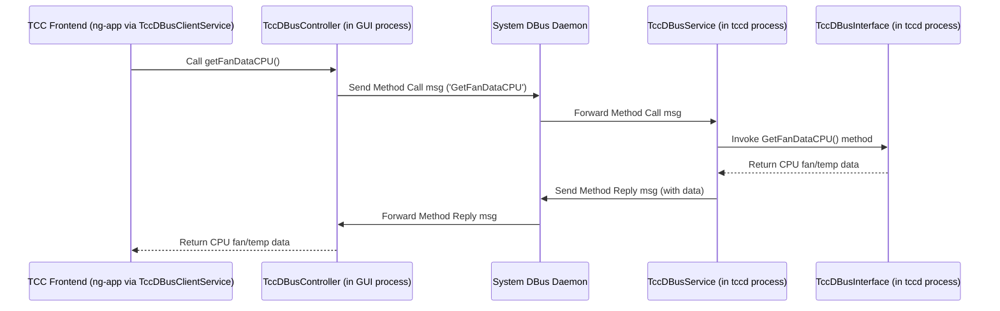

# Chapter 5: DBus Communication (TccDBusService / TccDBusController)

Welcome back! In [Chapter 4: TuxedoControlCenterDaemon (tccd)](04_tuxedocontrolcenterdaemon__tccd_.md), we met the `tccd` daemon, the background engineer that actually controls your laptop's hardware based on the selected performance profile. But how does the user interface (the [Angular Frontend (ng-app)](02_angular_frontend__ng_app_.md) you see) talk to this powerful background daemon? How does it ask for the current CPU temperature, or tell the daemon to switch to a different profile?

They need a communication channel, a way to send messages back and forth. This chapter explores that channel: **DBus Communication**, implemented through the `TccDBusService` (in the daemon) and `TccDBusController` (used by the GUI).

## What Problem Does DBus Communication Solve?

Imagine the TCC application is split into two main parts:

1.  **The Visible Window (GUI):** The [Angular Frontend (ng-app)](02_angular_frontend__ng_app_.md) running inside the [Electron Main Process (e-app)](03_electron_main_process__e_app_.md). This part runs as *your* normal user account.
2.  **The Background Daemon (`tccd`):** The [TuxedoControlCenterDaemon (tccd)](04_tuxedocontrolcenterdaemon__tccd_.md), running with special administrator (`root`) privileges to control hardware.

These two parts are separate programs! The GUI can't just directly call functions inside the daemon, especially since they run with different permissions. They need a safe and standard way to communicate.

**Think of DBus as the postal service for Linux desktop applications.**

*   The `tccd` daemon acts like a **post office (`TccDBusService`)**. It registers itself with the postal service (DBus) and says, "I offer these services: you can ask me for the current CPU temperature, get a list of available profiles, or tell me which profile to activate." It also holds the mailboxes (data like current sensor readings) that customers can query.
*   The TCC user interface acts like a **customer (`TccDBusController`)**. It goes to the postal service (DBus) and says, "I want to send a request to the TUXEDO Control Center post office (`com.tuxedocomputers.tccd`) to get the current CPU temperature." It then waits for the reply.

DBus handles the delivery of these messages between the different running programs.

**Use Case Example:** You open the TCC window, and it needs to display the current CPU temperature on the dashboard. The GUI (using `TccDBusController`) sends a "Get CPU Temperature" request via DBus to the `tccd` daemon. The daemon's `TccDBusService` receives this request, gets the latest temperature value, and sends it back as a reply via DBus to the GUI, which then displays it.

## Key Concepts of DBus

DBus (Desktop Bus) is a standard message bus system used heavily in Linux for Inter-Process Communication (IPC). Here are the key ideas:

*   **Bus:** A central channel where messages are sent. TCC typically uses the **System Bus**, which is used for system-wide services like `tccd` that need root privileges.
*   **Service Name (or Bus Name):** A unique name that a program registers on the bus so others can find it. The `tccd` daemon registers the name `com.tuxedocomputers.tccd`. Think of this as the unique address of the post office.
*   **Object Path:** Within a service, you can have different "objects" providing functionality. TCC uses `/com/tuxedocomputers/tccd`. Think of this as a specific department or counter within the post office.
*   **Interface:** A collection of methods and properties offered by an object. TCC defines its own interface, also named `com.tuxedocomputers.tccd`. This is like the list of services offered at that counter (e.g., "Get Temperature", "Set Profile").
*   **Methods:** Functions that a client can call on the service. Examples: `GetFanDataCPU()`, `SetTempProfileById(profileId)`. This is like filling out a request form at the post office counter.
*   **Properties:** Data values that a client can read (and sometimes write) from the service. DBus properties are less used in TCC compared to methods that return data. Think of these as publicly displayed information boards at the post office.
*   **Signals:** Notifications that the service can send out to any interested clients when something happens (e.g., "The active profile just changed!"). This is like the post office sending out a broadcast announcement.

## The TCC Implementation

*   **`TccDBusService` (Inside `tccd` - The Provider):**
    *   This class (found in `src/service-app/classes/TccDBusService.ts`) runs as part of the `tccd` daemon.
    *   It connects to the system DBus.
    *   It creates an instance of `TccDBusInterface` (`src/service-app/classes/TccDBusInterface.ts`).
    *   It registers (`exports`) the `TccDBusInterface` object on the DBus under the name `com.tuxedocomputers.tccd` and path `/com/tuxedocomputers/tccd`.
    *   `TccDBusInterface` defines all the methods (like `GetFanDataCPU`) that clients can call. When a method is called via DBus, the corresponding function in `TccDBusInterface` runs inside the `tccd` process.

*   **`TccDBusController` (Used by GUI - The Consumer):**
    *   This class (found in `src/common/classes/TccDBusController.ts`) is used by client applications, primarily the Angular frontend (via `TccDBusClientService` in `src/ng-app/app/tcc-dbus-client.service.ts`).
    *   It connects to the system DBus.
    *   It looks for the service named `com.tuxedocomputers.tccd`.
    *   It gets a "proxy" object that represents the remote `TccDBusInterface`.
    *   Calling a method on this proxy object (e.g., `controller.getFanDataCPU()`) automatically sends a DBus message to the `tccd` daemon, invokes the real method there, and returns the result.

## How DBus Solves Our Use Case (Fetching CPU Temp)

Let's trace the steps for the GUI dashboard getting the CPU temperature:

1.  **GUI Needs Data:** The `TccDBusClientService` in the Angular app decides it's time to update the dashboard data.
2.  **Call Controller Method:** It calls the `getFanDataCPU()` method on its instance of `TccDBusController`.
3.  **DBus Message (Client -> Bus):** `TccDBusController` creates a DBus "method call" message. This message basically says: "Destination: `com.tuxedocomputers.tccd`, Path: `/com/tuxedocomputers/tccd`, Interface: `com.tuxedocomputers.tccd`, Method: `GetFanDataCPU`". It sends this message onto the system bus.
4.  **DBus Routing (Bus -> Service):** The DBus daemon (the central postal worker) sees the destination address and forwards the message to the `tccd` process, which registered that name.
5.  **Service Receives Message:** The `dbus-next` library inside `tccd` receives the message and sees it's a call to the `GetFanDataCPU` method on the exported `TccDBusInterface` object.
6.  **Execute Method (Inside Daemon):** The `TccDBusInterface.GetFanDataCPU()` function runs. This function likely gets the latest CPU fan/temp data stored in the shared `TccDBusData` object (which is updated periodically by other workers like `FanControlWorker`).
7.  **Prepare Reply:** The `GetFanDataCPU()` function returns the data (e.g., an object containing temperature and fan speed).
8.  **DBus Message (Service -> Bus):** The `dbus-next` library packages this return value into a DBus "method reply" message and sends it back onto the bus, addressed to the original caller (the GUI).
9.  **DBus Routing (Bus -> Client):** The DBus daemon routes the reply back to the GUI process.
10. **Client Receives Reply:** The `TccDBusController` (specifically, the `await` on the `controller.getFanDataCPU()` call) receives the reply message, extracts the data, and returns it to the `TccDBusClientService`.
11. **GUI Updates:** The `TccDBusClientService` updates its internal state (e.g., a `BehaviorSubject`), and Angular's data binding updates the dashboard display.

## Under the Hood: Sending a Message

Let's visualize this client-server communication via DBus.

### Communication Flow Diagram



*This diagram shows the GUI initiating a call. The `TccDBusController` sends a message via the central DBus daemon to the `TccDBusService` in the `tccd` process. The service invokes the actual method on `TccDBusInterface`, gets the result, and sends it back via DBus.*

### Code Snippets

Let's look at simplified code pieces involved.

**1. Daemon: Exporting the Interface (`TccDBusService.ts`)**

This runs inside `tccd` to make its features available on DBus.

```typescript
// Simplified from src/service-app/classes/TccDBusService.ts
import * as dbus from 'dbus-next';
import { TccDBusInterface, TccDBusData } from './TccDBusInterface';
import { DaemonWorker } from './DaemonWorker';
import { TuxedoControlCenterDaemon } from './TuxedoControlCenterDaemon';

export class TccDBusService extends DaemonWorker {
    private interface: TccDBusInterface;
    private bus: dbus.MessageBus;
    private readonly serviceName = 'com.tuxedocomputers.tccd';
    private readonly path = '/com/tuxedocomputers/tccd';

    constructor(tccd: TuxedoControlCenterDaemon, private dbusData: TccDBusData) {
        super(1500, tccd); // Run 'work' method periodically

        try {
            this.bus = dbus.systemBus(); // Connect to system bus
            // Create the object that handles DBus requests
            this.interface = new TccDBusInterface(dbusData, /* options */);
        } catch (err) { /* Log error */ }
    }

    public onStart(): void {
        // Request the unique name on the bus
        this.bus.requestName(this.serviceName, 0)
            .then(() => {
                // Make our interface object available at the specified path
                // highlight-next-line
                this.bus.export(this.path, this.interface);
                this.tccd.logLine('DBus service exported');
            })
            .catch(err => { /* Log error */ });
    }
    // ... onWork(), onExit() ...
}
```

*This code connects to the system DBus and, in `onStart`, requests the unique name `com.tuxedocomputers.tccd`. If successful, it calls `this.bus.export()`, telling DBus that any messages sent to `/com/tuxedocomputers/tccd` should be handled by the `this.interface` object.*

**2. Daemon: Defining a DBus Method (`TccDBusInterface.ts`)**

This defines the actual methods available over DBus.

```typescript
// Simplified from src/service-app/classes/TccDBusInterface.ts
import * as dbus from 'dbus-next';
import { TccDBusData, FanData } from './TccDBusInterface'; // Structures defined here

export class TccDBusInterface extends dbus.interface.Interface {

    // Constructor receives the shared data object
    constructor(private data: TccDBusData, /* options */) {
        super('com.tuxedocomputers.tccd'); // Interface name must match
    }

    // Method implementation for GetFanDataCPU
    // highlight-next-line
    GetFanDataCPU(): /* Return Type Definition */ {
        // Simply return the current data from the shared object
        // This data is updated by other workers (e.g., FanControlWorker)
        return this.data.fans[0].export(); // export() formats it for DBus
    }

    // Method implementation for getting settings
    GetSettingsJSON(): string {
        return this.data.settingsJSON; // Return pre-serialized settings
    }

    // Method implementation for setting a temporary profile
    SetTempProfileById(id: string): boolean {
        this.data.tempProfileId = id; // Store the requested ID
        // Trigger the main daemon to re-evaluate the active state
        // this.interfaceOptions.triggerStateCheck(); // Logic omitted
        return true; // Indicate success
    }
    // ... many other methods defined here ...
}

// Configure the methods for DBus (signatures tell DBus what data types to expect)
TccDBusInterface.configureMembers({
    methods: {
        // highlight-start
        GetFanDataCPU: { outSignature: 'a{sa{sv}}' }, // Returns a dictionary structure
        GetSettingsJSON: { outSignature: 's' }, // Returns a string
        SetTempProfileById: { inSignature: 's', outSignature: 'b' }, // Takes string, returns boolean
        // highlight-end
        // ... other method signatures ...
    },
    // ... properties and signals configuration ...
});
```

*This class defines the methods like `GetFanDataCPU`. Notice it usually just reads data from the `this.data` object, which is shared and updated by other parts of `tccd`. The `configureMembers` section is crucial: it tells the `dbus-next` library the names and data types (`signatures`) for each method so DBus messages can be correctly created and parsed.*

**3. Client: Connecting to the Service (`TccDBusController.ts`)**

This code is used by the GUI (or other clients) to connect to the running `tccd` service.

```typescript
// Simplified from src/common/classes/TccDBusController.ts
import * as dbus from 'dbus-next';

export class TccDBusController {
    private busName = 'com.tuxedocomputers.tccd';
    private path = '/com/tuxedocomputers/tccd';
    private interfaceName = 'com.tuxedocomputers.tccd';
    private bus: dbus.MessageBus;
    private interface: dbus.ClientInterface; // Proxy object

    constructor() {
        this.bus = dbus.systemBus();
    }

    // Call this first to establish the connection
    async init(): Promise<boolean> {
        try {
            // Get a proxy object representing the remote service
            // highlight-next-line
            const proxyObject = await this.bus.getProxyObject(this.busName, this.path);
            // Get the specific interface we want to talk to
            // highlight-next-line
            this.interface = proxyObject.getInterface(this.interfaceName);
            return true; // Connection successful
        } catch (err) {
            this.interface = undefined; // Failed
            return false;
        }
    }
    // ... methods to call DBus functions ...

    disconnect(): void {
        this.bus.disconnect();
    }
}
```

*The `init()` method connects to the system bus and uses `getProxyObject` to find the `tccd` service by its name and path. Then, `getInterface` gets a special `ClientInterface` object. This `this.interface` object *looks* like the real `TccDBusInterface` in the daemon, but calling methods on it actually sends DBus messages.*

**4. Client: Calling a DBus Method (`TccDBusController.ts`)**

Once connected (`init` is successful), the client can call methods.

```typescript
// Simplified from src/common/classes/TccDBusController.ts
import { FanData } from '../../service-app/classes/TccDBusInterface'; // Import structure

export class TccDBusController {
    // ... properties and init() ...

    // Method to get CPU fan data
    async getFanDataCPU(): Promise<FanData> {
        if (!this.interface) return new FanData(); // Return empty if not connected
        try {
            // Calling the method on the proxy sends the DBus message
            // highlight-next-line
            return await this.interface.GetFanDataCPU();
        } catch (err) {
            return new FanData(); // Return empty on error
        }
    }

    // Method to get settings as JSON string
    async getSettingsJSON(): Promise<string> {
        if (!this.interface) return undefined;
        try {
            // highlight-next-line
            return await this.interface.GetSettingsJSON();
        } catch (err) { return undefined; }
    }

    // Method to set temporary profile by ID
    async setTempProfileById(profileId: string): Promise<boolean> {
        if (!this.interface) return false;
        try {
            // highlight-next-line
            return await this.interface.SetTempProfileById(profileId);
        } catch (err) { return false; }
    }
    // ... other methods mirroring TccDBusInterface ...
}
```

*These methods wrap the calls to the proxy object (`this.interface`). Calling `this.interface.GetFanDataCPU()` doesn't run local code (other than sending the message); it triggers the DBus communication flow described earlier, sending the request to `tccd` and waiting (`await`) for the reply.*

**5. Client: Using the Controller (`TccDBusClientService.ts` in `ng-app`)**

The Angular frontend uses `TccDBusController` via a service to keep its data updated.

```typescript
// Simplified from src/ng-app/app/tcc-dbus-client.service.ts
import { Injectable, OnDestroy } from '@angular/core';
import { TccDBusController } from '../../common/classes/TccDBusController';
import { BehaviorSubject } from 'rxjs'; // For reactive data
import { FanData } from '../../service-app/classes/TccDBusInterface';

// Interface for the fan data structure used in the service
export interface IDBusFanData { cpu: FanData; gpu1: FanData; gpu2: FanData; }

@Injectable({ providedIn: 'root' })
export class TccDBusClientService implements OnDestroy {
    private tccDBusInterface: TccDBusController;
    private timeout: NodeJS.Timeout;
    private updateInterval = 1000; // Update every second

    // BehaviorSubject holds the latest data and notifies subscribers
    public fanData = new BehaviorSubject<IDBusFanData>(/* initial empty data */);
    // ... other BehaviorSubjects for settings, profiles, etc. ...

    constructor() {
        this.tccDBusInterface = new TccDBusController();
        // Start trying to connect and update periodically
        this.periodicUpdate();
        this.timeout = setInterval(() => { this.periodicUpdate(); }, this.updateInterval);
    }

    private async periodicUpdate() {
        // Try to connect if not already connected
        const isAvailable = await this.tccDBusInterface.init();
        if (!isAvailable) return; // Exit if daemon not reachable

        // Fetch data using the controller's methods
        // highlight-start
        const cpuFan = await this.tccDBusInterface.getFanDataCPU();
        const gpu1Fan = await this.tccDBusInterface.getFanDataGPU1();
        const gpu2Fan = await this.tccDBusInterface.getFanDataGPU2();
        // highlight-end

        // Update the BehaviorSubject with the new data
        this.fanData.next({ cpu: cpuFan, gpu1: gpu1Fan, gpu2: gpu2Fan });

        // ... fetch and update other data (settings, active profile, etc.) ...
    }

    ngOnDestroy() {
        clearInterval(this.timeout); // Stop polling
        this.tccDBusInterface.disconnect(); // Disconnect from DBus
    }

    // Example of calling a method that sends data *to* the daemon
    public async setTempProfileById(profileId: string) {
        await this.tccDBusInterface.setTempProfileById(profileId);
        // Optionally trigger an immediate refresh after sending command
        this.triggerUpdate();
    }

    public async triggerUpdate() { await this.periodicUpdate(); }
}
```

*This Angular service (`TccDBusClientService`) creates an instance of `TccDBusController`. The `periodicUpdate` function runs regularly (e.g., every second). Inside it, it calls methods on the `tccDBusInterface` (like `getFanDataCPU`) to fetch the latest data from the `tccd` daemon via DBus. It then pushes this data into `BehaviorSubject` objects (`this.fanData.next(...)`). Components in the Angular UI subscribe to these subjects to get live updates.*

## Conclusion

DBus is the vital communication link between the TUXEDO Control Center frontend (GUI) and the background `tccd` daemon. It acts like a postal service, allowing these separate processes, running with different permissions, to exchange information and commands safely.

*   **`TccDBusService`** (running within the privileged `tccd` daemon) acts as the **service provider**, exporting methods and data via the `TccDBusInterface`.
*   **`TccDBusController`** (used by the unprivileged GUI) acts as the **service consumer**, connecting to the daemon over DBus and calling its methods as if they were local.

Understanding this client-server communication over DBus is key to seeing how user actions in the TCC window result in changes to the laptop's hardware managed by the daemon.

We've seen how the daemon gets started, how it communicates, and how it uses profiles. But how exactly does it load and manage those profile files and other settings from disk? That's what we'll explore in the next chapter: [Configuration Handling (ConfigHandler)](06_configuration_handling__confighandler_.md).

---

Generated by [AI Codebase Knowledge Builder](https://github.com/The-Pocket/Tutorial-Codebase-Knowledge)