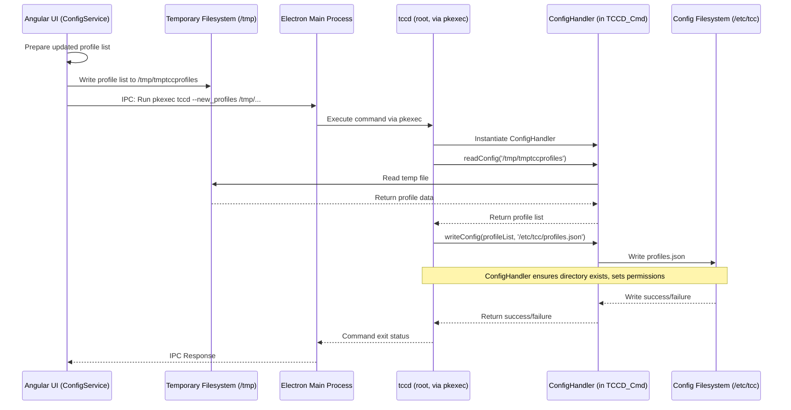

# Chapter 6: Configuration Handling (ConfigHandler)

Welcome back! In [Chapter 5: DBus Communication (TccDBusService / TccDBusController)](05_dbus_communication__tccdbusservice___tccdbuscontroller_.md), we learned how the TUXEDO Control Center (TCC) user interface (GUI) talks to the background daemon (`tccd`) using the DBus messaging system. The GUI can ask the daemon for things like the current temperature, or tell it to activate a specific performance profile.

But wait, when you create a custom profile or change a setting (like switching to Fahrenheit), how does TCC remember that choice the next time you start your computer? Where does the daemon get the list of custom profiles when it starts up? This is where **Configuration Handling** comes in.

This chapter introduces the `ConfigHandler`, TCC's internal librarian responsible for reading and writing the application's settings and custom data to files on your disk.

## What Problem Does the ConfigHandler Solve?

Applications often need to store information persistently, meaning the data should still be there even after you close the application or restart your computer. TCC needs to remember:

*   Your custom performance profiles ([TccProfile (Performance Profiles)](01_tccprofile__performance_profiles_.md)).
*   Global settings, like which profile is active when plugged in vs. on battery, or whether to display temperatures in Fahrenheit.
*   Other saved states, like the last used keyboard backlight settings.

Without a way to save and load this information, TCC would reset to its default state every time it starts, forgetting all your customizations!

The `ConfigHandler` solves this by managing the reading and writing of configuration files stored on your computer's hard drive. It acts like the application's **memory bank** for data that needs to stick around.

**Use Case Example:** You spend time creating a perfect custom performance profile called "My Ultimate Coding Profile". You save it in the TCC profile manager. The `ConfigHandler` (working behind the scenes) is responsible for writing this new profile into a configuration file. When you restart TCC or your computer, the `tccd` daemon uses the `ConfigHandler` again to read that file, loading "My Ultimate Coding Profile" back into the application so you can use it.

## Key Concepts of ConfigHandler

*   **What is ConfigHandler?** It's a helper class within TCC (`src/common/classes/ConfigHandler.ts`). Its main job is to know *where* the configuration files are stored and *how* to read data from them and write data back to them. It doesn't decide *what* to save, but performs the actual file operations.
*   **Configuration Files:** These are files on your disk where TCC stores its persistent data. The most important ones managed by `ConfigHandler` are:
    *   `settings.json`: Contains global application settings (like the active profile IDs for AC/Battery states, temperature unit preference, enabled features).
    *   `profiles.json`: Stores the definitions of all your **custom** performance profiles. Default profiles are usually built into the application, not stored here.
    *   (Others like `autosave.json`, `fantables.json`, `webcam.json` store other specific states).
*   **Location:** These configuration files are typically stored in a system-wide directory, `/etc/tcc/`. This location is chosen because the settings affect the whole system (hardware control) and need to be managed by the `tccd` daemon, which runs as root.
    *   **Important:** Because they are in `/etc/`, modifying these files requires **administrator (root) privileges**. This is why saving settings or profiles from the GUI often involves `pkexec`, as we saw in [Chapter 3: Electron Main Process (e-app)](03_electron_main_process__e_app_.md).
*   **Format:** The configuration files are usually stored in **JSON** (JavaScript Object Notation) format. JSON is a text-based format that's easy for both humans to read (if needed) and computers to parse. It represents data as key-value pairs and arrays, much like the data structures used inside TCC (like `ITccSettings` or `ITccProfile`).
*   **Reading (Loading):** When the [TuxedoControlCenterDaemon (tccd)](04_tuxedocontrolcenterdaemon__tccd_.md) starts up, one of its first tasks is to use its `ConfigHandler` instance to read the contents of `/etc/tcc/settings.json`, `/etc/tcc/profiles.json`, etc., loading the data into its memory.
*   **Writing (Saving):** When a change needs to be saved permanently (e.g., user saves an edited custom profile, or changes a global setting in the GUI), the request eventually leads to the `tccd` daemon using its `ConfigHandler` to write the updated data back to the corresponding JSON file in `/etc/tcc/`, overwriting the old content.

## How ConfigHandler Solves Our Use Case (Saving "My Ultimate Coding Profile")

Let's trace the steps involved when you save your new custom profile:

1.  **User Action:** You finish editing your profile in the TCC profile manager ([Angular Frontend (ng-app)](02_angular_frontend__ng_app_.md)) and click "Save".
2.  **Angular Service (`ConfigService`):** The `ConfigService` in the Angular app receives the new profile data. It knows it needs to update the list of custom profiles.
3.  **Prepare Updated List:** The `ConfigService` gets the current list of custom profiles, adds your new "My Ultimate Coding Profile" to it (or updates it if it already existed).
4.  **Write to Temporary File:** Because the `ConfigService` runs without root privileges, it can't directly write to `/etc/tcc/profiles.json`. Instead, it uses the `ConfigHandler`'s `writeConfig` method (or Node.js `fs` module directly) to write the *entire updated list* of custom profiles to a **temporary file** (e.g., `/tmp/tmptccprofiles`). This temporary file is usually writable by the normal user.
5.  **Request Privileged Write:** The `ConfigService` uses Electron IPC to ask the [Electron Main Process (e-app)](03_electron_main_process__e_app_.md) to execute a privileged command.
6.  **Execute `pkexec`:** The `e-app` runs a command similar to: `pkexec /usr/bin/tccd --new_profiles /tmp/tmptccprofiles`. This asks the system to run the `tccd` executable as root, passing it the path to the temporary file containing the new profile list.
7.  **`tccd` Handles Argument:** The `tccd` process (now running as root for this command) sees the `--new_profiles` argument.
8.  **`tccd` Uses `ConfigHandler`:** Inside the code handling this argument, `tccd` uses its *own* instance of `ConfigHandler`.
    *   It calls `config.readConfig<ITccProfile[]>('/tmp/tmptccprofiles')` to read the profile list from the temporary file.
    *   It then calls `config.writeConfig<ITccProfile[]>(newProfileList, '/etc/tcc/profiles.json', { mode: 0o644 })` to write this list to the **actual configuration file**, overwriting the old one. Since `tccd` is running as root here, it has permission to write to `/etc/tcc/`.
9.  **Signal Reload (Optional but common):** The `tccd` command might then send a signal (like `SIGHUP`) to the main running `tccd` daemon process, telling it to reload its configuration now that the files have changed.
10. **Daemon Reloads:** The main `tccd` daemon receives the signal, calls its `loadConfigsAndProfiles` method, which uses `ConfigHandler` again to read the *updated* `/etc/tcc/profiles.json`, making "My Ultimate Coding Profile" immediately available.

The `ConfigHandler` is used both by the GUI side (to prepare the temporary file) and the privileged daemon side (to read the temporary file and write the final file).

## Under the Hood: Reading and Writing Files

Let's look at the flow and some simplified code.

### Saving Flow Diagram



*This diagram shows the process: The GUI prepares the data and writes it to a temporary file. It asks Electron to run `tccd` via `pkexec`. The privileged `tccd` command uses `ConfigHandler` to read the temp file and then uses `ConfigHandler` again to write the final configuration file in `/etc/tcc`.*

### Code Snippets

**1. `ConfigHandler` Constructor and Paths**

The `ConfigHandler` is initialized with the paths to the configuration files it will manage.

```typescript
// Simplified from src/common/classes/ConfigHandler.ts
import * as fs from 'fs';
import * as path from 'path';
import { ITccSettings } from '../models/TccSettings'; // Import data structure interfaces
import { ITccProfile } from '../models/TccProfile';

export class ConfigHandler {
    public settingsFileMod = 0o644; // Default file permissions (read/write for owner, read for others)
    public profileFileMod = 0o644;
    // ... other permission modes ...

    // The constructor takes the paths to the config files
    // highlight-start
    constructor(
        private _pathSettings: string,
        private _pathProfiles: string,
        private _pathWebcam: string,
        private _pathV4l2Names: string,
        private _pathAutosave: string,
        private _pathFantables: string
    ) {}
    // highlight-end

    // Getters for the paths
    get pathSettings() { return this._pathSettings; }
    get pathProfiles() { return this._pathProfiles; }
    // ... other getters ...

    // ... methods for reading/writing ...
}

// How it might be instantiated in the daemon (TuxedoControlCenterDaemon.ts)
// import { TccPaths } from '../../common/classes/TccPaths'; // Contains the actual paths
// this.config = new ConfigHandler(
//     TccPaths.SETTINGS_FILE,      // e.g., '/etc/tcc/settings.json'
//     TccPaths.PROFILES_FILE,     // e.g., '/etc/tcc/profiles.json'
//     TccPaths.WEBCAM_FILE,       // e.g., '/etc/tcc/webcam.json'
//     TccPaths.V4L2_NAMES_FILE,   // ...
//     TccPaths.AUTOSAVE_FILE,     // ...
//     TccPaths.FANTABLES_FILE     // ...
// );
```

*The `ConfigHandler` stores the file paths provided to its constructor. It also defines default file permissions (like `0o644`). The actual paths (like `/etc/tcc/settings.json`) are usually defined in a separate `TccPaths` class and passed in when creating the `ConfigHandler` instance.*

**2. Reading Configuration (`readConfig`)**

This method reads a specified file, parses it as JSON, and returns the data structured according to the provided type `<T>`.

```typescript
// Simplified from src/common/classes/ConfigHandler.ts
import * as fs from 'fs';

export class ConfigHandler {
    // ... constructor and paths ...

    /**
     * Reads a configuration file and parses it as JSON.
     * @param filename The full path to the file to read.
     * @returns The parsed data object. Throws error if file read/parse fails.
     */
    public readConfig<T>(filename: string): T {
        let config: T;
        try {
            // Read the entire file content as a buffer/string
            // highlight-next-line
            const fileData = fs.readFileSync(filename);
            // Parse the string content as JSON into a JavaScript object
            // highlight-next-line
            config = JSON.parse(fileData.toString());
        } catch (err) {
            console.error(`ConfigHandler: Failed to read or parse ${filename}`, err);
            throw err; // Re-throw the error for the caller to handle
        }
        return config;
    }

    // Example Usage in tccd's loadConfigsAndProfiles():
    // this.settings = this.config.readConfig<ITccSettings>(this.config.pathSettings);
    // this.customProfiles = this.config.readConfig<ITccProfile[]>(this.config.pathProfiles);
}
```

*The `readConfig<T>` method uses Node.js's built-in `fs.readFileSync` to get the file content. It then uses `JSON.parse` to convert the text data into a JavaScript object. The `<T>` part (a generic type parameter) allows the caller to specify the expected structure (like `ITccSettings` or `ITccProfile[]`), helping with type checking in TypeScript.*

**3. Writing Configuration (`writeConfig`)**

This method takes a JavaScript object, converts it to a JSON string, and writes it to the specified file.

```typescript
// Simplified from src/common/classes/ConfigHandler.ts
import * as fs from 'fs';
import * as path from 'path';

export class ConfigHandler {
    // ... constructor, paths, readConfig ...

    /**
     * Writes a configuration object to a file as JSON.
     * Creates directories if they don't exist.
     * @param config The JavaScript object to save.
     * @param filePath The full path to the file to write.
     * @param writeFileOptions Options like file mode (permissions).
     */
    public writeConfig<T>(config: T, filePath: string, writeFileOptions: { mode: number }): void {
        // Convert the JavaScript object into a JSON string
        // highlight-next-line
        const fileData = JSON.stringify(config, null, 2); // Use pretty-printing (indentation)

        try {
            // Ensure the directory exists before writing the file
            const dirPath = path.dirname(filePath);
            // highlight-next-line
            if (!fs.existsSync(dirPath)) {
                // highlight-next-line
                fs.mkdirSync(dirPath, { mode: 0o755, recursive: true }); // Create recursively with 755 permissions
            }
            // Write the JSON string to the file, overwriting if it exists
            // highlight-next-line
            fs.writeFileSync(filePath, fileData, writeFileOptions);
        } catch (err) {
            console.error(`ConfigHandler: Failed to write ${filePath}`, err);
            throw err; // Re-throw the error
        }
    }

    // Example Usage in tccd handling --new_profiles:
    // const newProfiles = this.config.readConfig<ITccProfile[]>('/tmp/tmptccprofiles');
    // this.config.writeConfig<ITccProfile[]>(newProfiles, this.config.pathProfiles, { mode: this.config.profileFileMod });
}
```

*`writeConfig<T>` first uses `JSON.stringify` to convert the input object (`config`) into a formatted JSON string. It then checks if the target directory exists using `fs.existsSync` and `path.dirname`. If not, it creates the directory structure recursively using `fs.mkdirSync`. Finally, it writes the JSON string to the file using `fs.writeFileSync`, applying the specified file permissions from `writeFileOptions`.*

**4. Daemon: Loading Configuration at Startup (`TuxedoControlCenterDaemon.ts`)**

The `tccd` daemon uses `ConfigHandler` when it starts to load its initial state.

```typescript
// Simplified from src/service-app/classes/TuxedoControlCenterDaemon.ts
import { ConfigHandler } from '../../common/classes/ConfigHandler';
import { TccPaths } from '../../common/classes/TccPaths';
import { ITccSettings } from '../../common/models/TccSettings';
import { ITccProfile } from '../../common/models/TccProfile';

export class TuxedoControlCenterDaemon /* ... */ {
    public config: ConfigHandler; // The ConfigHandler instance
    public settings: ITccSettings;
    public customProfiles: ITccProfile[];
    // ... other properties ...

    constructor() {
        // ... other setup ...
        // Create the ConfigHandler instance with standard paths
        // highlight-next-line
        this.config = new ConfigHandler(
            TccPaths.SETTINGS_FILE,
            TccPaths.PROFILES_FILE,
            /* ... other paths ... */
        );
    }

    async main() {
        // ... check root, handle arguments ...

        // Load configurations early in the startup process
        // highlight-next-line
        this.loadConfigsAndProfiles();

        // ... setup signal handling, create workers, start workers ...
    }

    /** Reads config files or creates defaults if they don't exist or are invalid */
    public loadConfigsAndProfiles() {
        try {
            // Use ConfigHandler to read settings
            // highlight-next-line
            this.settings = this.config.readSettings();
            // ... (code to check settings validity and fill missing parts with defaults) ...
        } catch (err) {
            this.logLine(`Failed to read settings, creating defaults: ${this.config.pathSettings}`);
            this.settings = this.config.getDefaultSettings(/* device */);
            // highlight-next-line
            this.config.writeSettings(this.settings); // Save the defaults
        }

        try {
            // Use ConfigHandler to read custom profiles
            // highlight-next-line
            this.customProfiles = this.config.readProfiles(/* device */);
            // ... (code to check profile validity and fill missing parts) ...
        } catch (err) {
            this.logLine(`Failed to read profiles, creating defaults: ${this.config.pathProfiles}`);
            this.customProfiles = this.config.getDefaultCustomProfiles(/* device */);
            // highlight-next-line
            this.config.writeProfiles(this.customProfiles); // Save the defaults
        }

        // ... load other configs (autosave, fantables) similarly ...
        // ... update DBus data with loaded configs ...
    }
    // ... other methods ...
}
```

*The daemon creates its `ConfigHandler` in the constructor. The `loadConfigsAndProfiles` method (called from `main`) uses `this.config.readSettings()` and `this.config.readProfiles()` to load the data. Crucially, it includes error handling (`try...catch`): if a config file doesn't exist or is corrupt, it loads default values and uses `this.config.writeSettings()` or `this.config.writeProfiles()` to create the file with default content.*

**5. Daemon: Handling Privileged Writes (`TuxedoControlCenterDaemon.ts`)**

This shows how `tccd` handles the `--new_profiles` argument, using `ConfigHandler` to perform the privileged write.

```typescript
// Simplified from src/service-app/classes/TuxedoControlCenterDaemon.ts

export class TuxedoControlCenterDaemon /* ... */ {
    // ... properties, constructor, main ...

    /** Handles command-line arguments like --start, --stop, --new_settings */
    private async handleArgumentProgramFlow() {
        // ... handle --start, --stop ...

        // Check if --new_profiles argument is present
        // highlight-next-line
        else if (process.argv.includes('--new_profiles')) {
            // Save the new profiles config passed via command line
            // highlight-next-line
            const profilesSaved = this.saveNewConfig<ITccProfile[]>(
                '--new_profiles',                   // The argument name
                this.config.pathProfiles,           // Target file (/etc/tcc/profiles.json)
                this.config.profileFileMod          // File permissions (0o644)
            );

            // If saved successfully, signal the running daemon to reload
            if (profilesSaved) {
                const pidNumber = this.readPid(); // Get PID of main daemon process
                if (!isNaN(pidNumber)) {
                    // highlight-next-line
                    process.kill(pidNumber, 'SIGHUP'); // Send reload signal
                }
            }
            process.exit(0); // Exit after handling the argument
        }
        // ... handle --new_settings, --new_webcam similarly ...
        else {
            throw Error('No valid argument specified');
        }
    }

    /** Helper method to read temp path from args and write to target path */
    private saveNewConfig<T>(optionString: string, targetConfigPath: string, writeFileMode: number): boolean {
        // Get the temporary file path from the command line argument after optionString
        const newConfigPath = this.getPathArgument(optionString); // e.g., '/tmp/tmptccprofiles'
        if (newConfigPath !== '') {
            try {
                // Read the config from the temporary path using ConfigHandler
                // highlight-next-line
                let newConfig: T = this.config.readConfig<T>(newConfigPath);

                // Write the config to the final target path using ConfigHandler
                // (Runs as root, so has permission for /etc/tcc/)
                // highlight-next-line
                this.config.writeConfig<T>(newConfig, targetConfigPath, { mode: writeFileMode });
                return true; // Success
            } catch (err) {
                this.logLine(`Error handling ${optionString}: ${err.message}`);
                return false; // Failed
            }
        }
        return false; // Argument not found
    }

    /** Helper to get the argument value following optionString */
    private getPathArgument(optionString: string): string {
        const index = process.argv.indexOf(optionString);
        if (index !== -1 && index < process.argv.length - 1) {
            return process.argv[index + 1];
        }
        return '';
    }
    // ... other methods ...
}
```

*The `handleArgumentProgramFlow` checks for arguments like `--new_profiles`. If found, it calls `saveNewConfig`. This helper function gets the temporary file path (e.g., `/tmp/tmptccprofiles`) supplied after the argument, uses `this.config.readConfig` to load data from that temp file, and then crucially uses `this.config.writeConfig` to save that data to the *actual* configuration path (e.g., `/etc/tcc/profiles.json`). Since this code runs via `pkexec`, it has the root permissions needed for the final write.*

## Conclusion

The `ConfigHandler` is TCC's internal tool for interacting with configuration files on disk. It acts as the persistent memory, ensuring your custom profiles and settings are remembered between application restarts and system reboots.

You've learned:

*   Why persistent configuration is necessary.
*   That `ConfigHandler` manages reading and writing standard JSON configuration files (like `settings.json`, `profiles.json`) located in `/etc/tcc/`.
*   How the `tccd` daemon uses `ConfigHandler` at startup to load configurations.
*   How saving changes from the GUI involves writing to a temporary file, then using `pkexec` to run `tccd` with root privileges, which then uses `ConfigHandler` to write the final file in `/etc/tcc/`.

Understanding the `ConfigHandler` shows how TCC makes your customizations permanent by safely managing system configuration files.

Now that we know how profiles are defined, how the UI works, how the daemon runs, how they communicate, and how configurations are saved, let's start looking deeper into *how* the `tccd` daemon actually interacts with the hardware to apply these settings. In the next chapter, we'll explore a key low-level component: [TuxedoIOAPI (Native Binding)](07_tuxedoioapi__native_binding_.md).

---

Generated by [AI Codebase Knowledge Builder](https://github.com/The-Pocket/Tutorial-Codebase-Knowledge)