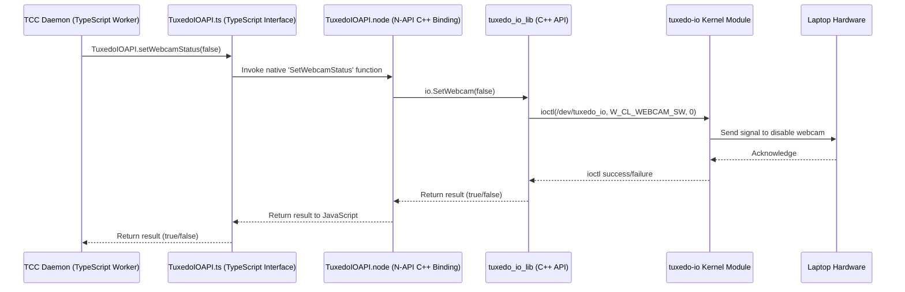

# Chapter 7: TuxedoIOAPI (Native Binding)

Welcome back! In [Chapter 6: Configuration Handling (ConfigHandler)](06_configuration_handling__confighandler_.md), we saw how TUXEDO Control Center (TCC) saves and loads your settings and custom profiles using the `ConfigHandler`. This ensures your preferences stick around.

Now, let's dive deeper into how the TCC daemon (`tccd`) actually *controls* some of the unique hardware features of your TUXEDO laptop. While some settings can be changed by writing to standard Linux system files (which we'll see in [Chapter 8: SysFsPropertyIO / SysFsController](08_sysfspropertyio___sysfscontroller.md)), many TUXEDO-specific features require a more direct approach. This chapter introduces the **TuxedoIOAPI**, the special communication line to your laptop's unique hardware capabilities.

## What Problem Does the TuxedoIOAPI Solve?

Imagine your TUXEDO laptop has special features like:

*   A physical switch or key combination to disable the webcam.
*   Precise fan control curves tuned specifically for the cooling system.
*   Special power limit settings (TDP - Thermal Design Power) for the CPU/GPU.
*   Vendor-specific performance modes (ODM Profiles).

These features aren't always controllable through standard Linux interfaces like the `/sys` filesystem. They often require talking directly to a specialized driver or embedded controller within the laptop. TUXEDO Computers provides a kernel module called `tuxedo-io` (or similar, like `tuxedo-keyboard`) that understands how to talk to this specific hardware.

But how does our TCC daemon (`tccd`), primarily written in TypeScript (which runs on Node.js), send commands to this low-level kernel module? Node.js isn't designed for direct hardware communication like this.

The **TuxedoIOAPI** solves this problem by acting as a **specialized translator**. It bridges the gap between the high-level TypeScript world of the daemon and the low-level C/Kernel world of the `tuxedo-io` module.

**Use Case Example:** You want to disable your webcam using the toggle in TCC. This isn't just changing a file; it involves sending a specific command to the hardware via the `tuxedo-io` kernel module. The `tccd` daemon needs a way to send that specific "disable webcam" command. TuxedoIOAPI provides the function call to do exactly that.

## Key Concepts of TuxedoIOAPI

Think of getting a command to the hardware like a chain of translators:

1.  **`tuxedo-io` Kernel Module:** This is the code running deep inside the Linux kernel. It's the **native speaker** of the hardware's language for TUXEDO-specific features. It exposes a special "device file" (like `/dev/tuxedo_io`) and understands specific low-level commands (`ioctl` calls) sent to that file.
2.  **`tuxedo_io_api.hh` / `tuxedo_io_lib` (C++ Library):** This is a library written in C++. C++ is much better suited for talking directly to kernel modules. This library knows *which* `ioctl` commands to send to `/dev/tuxedo_io` to achieve specific actions (like "set fan speed" or "get webcam status"). Think of this as a **bilingual translator** who speaks C++ and also understands the specific `ioctl` commands the kernel module speaks.
3.  **N-API (Node API):** This is a standard feature of Node.js that allows JavaScript/TypeScript code to call functions written in C or C++. It defines the rules and methods for this communication. Think of it as the **standard communication protocol** between Node.js and native code addons.
4.  **`TuxedoIOAPI.node` (The Native Binding):** This is the compiled result of wrapping the C++ library (`tuxedo_io_lib`) using N-API. It's a binary file that Node.js can load. It exposes the C++ functions (like `SetWebcamStatus`) in a way that JavaScript/TypeScript can call them. This is the **actual translator** module, ready to receive instructions from Node.js and pass them to the C++ library.
5.  **`TuxedoIOAPI.ts` (TypeScript Definition):** This is a TypeScript file (`src/native-lib/TuxedoIOAPI.ts`) in the TCC codebase. It imports the `TuxedoIOAPI.node` file and provides clear TypeScript definitions (an `interface`) for all the available functions. This makes it easy and type-safe for the rest of the TCC daemon code to use the native functions. It's like the **user manual** for the translator, written in TypeScript.

**In short:** The `tccd` daemon (TypeScript) calls a function defined in `TuxedoIOAPI.ts`. This call goes through N-API to the C++ code in `TuxedoIOAPI.node`. The C++ code uses `tuxedo_io_lib` to send the correct `ioctl` command to the `tuxedo-io` kernel module, which finally interacts with the hardware.

## How TuxedoIOAPI Solves the Use Case (Toggling Webcam)

Let's trace the steps when you toggle the webcam off in the TCC UI:

1.  **User Action:** Click the webcam toggle in the [Angular Frontend (ng-app)](02_angular_frontend__ng_app_.md).
2.  **GUI Request:** The frontend sends a request via DBus (using [DBus Communication](05_dbus_communication__tccdbusservice___tccdbuscontroller_.md)) to the [TuxedoControlCenterDaemon (tccd)](04_tuxedocontrolcenterdaemon__tccd_.md), asking it to set the webcam status to `false`.
3.  **Daemon Worker:** The `WebcamWorker` inside `tccd` receives this request.
4.  **Call TuxedoIOAPI:** The `WebcamWorker` imports the `TuxedoIOAPI` object from `src/native-lib/TuxedoIOAPI.ts`. It then calls the function:
    ```typescript
    TuxedoIOAPI.setWebcamStatus(false);
    ```
5.  **TypeScript to N-API:** This call is directed to the `TuxedoIOAPI.node` native binding.
6.  **N-API Binding Executes C++:** The N-API wrapper function `SetWebcamStatus` (defined in `src/native-lib/tuxedo_io_napi.cc`) executes. It receives the `false` value from JavaScript.
7.  **Call C++ Library:** This C++ function creates an instance of the `TuxedoIOAPI` C++ class (from `src/native-lib/tuxedo_io_lib/tuxedo_io_api.hh`) and calls its `SetWebcam` method:
    ```cpp
    // Inside tuxedo_io_napi.cc's SetWebcamStatus wrapper
    TuxedoIOAPI io; // C++ class instance
    bool status = info[0].As<Boolean>(); // Get the 'false' value
    bool result = io.SetWebcam(status); // Call the C++ library function
    ```
8.  **C++ Library Sends ioctl:** The `TuxedoIOAPI::SetWebcam` method (in `tuxedo_io_api.hh`) determines the correct underlying device interface (e.g., Clevo or Uniwill) and calls its `SetWebcam` method. This eventually uses the `IO` helper class to make an `ioctl` system call to the `/dev/tuxedo_io` device file, sending a specific command code (like `W_CL_WEBCAM_SW` defined in `tuxedo_io_ioctl.h`) with the `0` (false) value.
    ```cpp
    // Inside ClevoDevice::SetWebcam (in tuxedo_io_api.hh)
    int argument = status ? 1 : 0; // Convert boolean to 0 or 1
    // Use the IO helper to send the command to the kernel module
    return io->IoctlCall(W_CL_WEBCAM_SW, argument);
    ```
9.  **Kernel Module Acts:** The `tuxedo-io` kernel module receives the `ioctl` command and interacts with the laptop's embedded controller or hardware registers to physically disable the webcam connection.
10. **Result Returns:** The success or failure of the operation travels back up the chain: kernel module -> `ioctl` result -> C++ library -> N-API wrapper -> TypeScript caller (`WebcamWorker`). The worker can then update the status via DBus.

## Under the Hood: The Binding Layers

Let's look at the different layers involved.

### Communication Flow Diagram



*This diagram shows a call originating from the TypeScript daemon worker. It passes through the TypeScript wrapper, the N-API binding, the C++ library, finally reaching the kernel module via an `ioctl` system call, which interacts with the hardware. The result flows back up.*

### Code Snippets

**1. TypeScript Wrapper (`src/native-lib/TuxedoIOAPI.ts`)**

This file defines the interface for the native module and imports the compiled `.node` file.

```typescript
// Simplified from src/native-lib/TuxedoIOAPI.ts

// Interface defining the functions available from the native module
export interface ITuxedoIOAPI {
    /** Check if the kernel module communication channel is available */
    wmiAvailable(): boolean;

    /** Get number of controllable fan interfaces */
    getNumberFans(): number;

    /** Set all fans to automatic (firmware default) mode */
    setFansAuto(): boolean;

    /** Set speed of a specific fan (0-100%) */
    setFanSpeedPercent(fanNumber: number, fanSpeedPercent: number): boolean;

    /** Get temperature associated with a specific fan sensor (Celsius) */
    getFanTemperature(fanNumber: number, fanTemperatureCelcius: ObjWrapper<number>): boolean;

    // highlight-start
    /** Enable or disable the webcam hardware switch */
    setWebcamStatus(webcamOn: boolean): boolean;
    /** Get the current status of the webcam hardware switch */
    getWebcamStatus(status: ObjWrapper<boolean>): boolean;
    // highlight-end

    // ... other functions for ODM profiles, TDP, etc. ...
}

// Helper class used for functions that return values via output parameters
export class ObjWrapper<T> {
    value: T;
}

// IMPORTANT: This line loads the compiled C++ native addon
// highlight-next-line
export const TuxedoIOAPI: ITuxedoIOAPI = require('./TuxedoIOAPI.node');
```

*This defines the `ITuxedoIOAPI` interface, listing the functions like `setWebcamStatus` that the daemon code can call. The `require('./TuxedoIOAPI.node')` line actually loads the compiled C++ binding, making these functions available.*

**2. N-API Binding Wrapper (`src/native-lib/tuxedo_io_napi.cc`)**

This C++ code uses N-API to expose the underlying C++ library functions to Node.js.

```cpp
// Simplified from src/native-lib/tuxedo_io_napi.cc
#include <napi.h>
#include "tuxedo_io_lib/tuxedo_io_api.hh" // Include the C++ library header

using namespace Napi;

// N-API wrapper function for SetWebcamStatus
// highlight-start
Boolean SetWebcamStatus(const CallbackInfo &info) {
    // Get the JavaScript environment (needed for N-API)
    Env env = info.Env();

    // Check arguments: expect 1 boolean argument
    if (info.Length() != 1 || !info[0].IsBoolean()) {
        throw Napi::Error::New(env, "SetWebcamStatus - invalid argument");
    }

    // Create an instance of our C++ API class
    TuxedoIOAPI io;

    // Convert the JavaScript boolean argument to a C++ bool
    bool status = info[0].As<Boolean>();

    // Call the actual C++ library function
    bool result = io.SetWebcam(status);

    // Convert the C++ boolean result back to a JavaScript boolean and return it
    return Boolean::New(env, result);
}
// highlight-end

// N-API wrapper function for GetWebcamStatus
Boolean GetWebcamStatus(const CallbackInfo &info) {
    Env env = info.Env();
    // Expect 1 argument: an object to store the result in (like ObjWrapper)
    if (info.Length() != 1 || !info[0].IsObject()) { /* ... throw error ... */ }

    TuxedoIOAPI io;
    bool status = false; // C++ variable to hold the result
    // Call the C++ library function, passing the status variable by reference
    bool result = io.GetWebcam(status);

    // Get the JavaScript object passed as argument
    Object objWrapper = info[0].As<Object>();
    // Set the 'value' property on the JavaScript object with the result
    objWrapper.Set("value", Boolean::New(env, status));

    // Return the success/failure of the GetWebcam call itself
    return Boolean::New(env, result);
}

// ... wrapper functions for all other exported methods ...

// Init function: Called by Node.js when the addon is loaded
Object Init(Env env, Object exports) {
    // Export the C++ functions under their JavaScript names
    // highlight-next-line
    exports.Set(String::New(env, "setWebcamStatus"), Function::New(env, SetWebcamStatus));
    exports.Set(String::New(env, "getWebcamStatus"), Function::New(env, GetWebcamStatus));
    exports.Set(String::New(env, "wmiAvailable"), Function::New(env, WmiAvailable));
    exports.Set(String::New(env, "getNumberFans"), Function::New(env, GetNumberFans));
    // ... export all other functions ...

    return exports;
}

// Register the addon with Node.js
NODE_API_MODULE(TuxedoIOAPI, Init);
```

*This C++ code defines functions like `SetWebcamStatus`. These functions use N-API features (`Env`, `CallbackInfo`, `Boolean`, `Object`) to interact with the JavaScript environment. They extract arguments passed from JavaScript, call the corresponding methods of the `TuxedoIOAPI` C++ class, and return the results back to JavaScript. The `Init` function tells Node.js which C++ functions to expose and what names they should have in JavaScript.*

**3. C++ Library (`src/native-lib/tuxedo_io_lib/tuxedo_io_api.hh`)**

This header file defines the C++ classes that interact with the kernel module via `ioctl`.

```cpp
// Simplified from src/native-lib/tuxedo_io_lib/tuxedo_io_api.hh
#pragma once
#include <string>
#include <vector>
#include <fcntl.h> // For open()
#include <unistd.h> // For close()
#include <sys/ioctl.h> // For ioctl()
#include "tuxedo_io_ioctl.h" // Defines command codes like W_CL_WEBCAM_SW

// Helper class to manage opening/closing the device file and making ioctl calls
class IO {
public:
    IO(const char *file) { _fileHandle = open(file, O_RDWR); }
    ~IO() { if (_fileHandle >= 0) close(_fileHandle); }
    bool IOAvailable() { return _fileHandle >= 0; }
    // Simplified ioctl call for setting an integer value
    bool IoctlCall(unsigned long request, int &argument) {
        if (!IOAvailable()) return false;
        // highlight-next-line
        int result = ioctl(_fileHandle, request, &argument);
        return result >= 0; // Return true on success
    }
    // ... other ioctl call variations ...
private:
    int _fileHandle = -1;
};

// Abstract base class for different device interfaces (e.g., Clevo, Uniwill)
class DeviceInterface {
public:
    DeviceInterface(IO &io) : io(&io) {}
    virtual ~DeviceInterface() {}
    // Pure virtual function for setting webcam status
    virtual bool SetWebcam(const bool status) = 0;
    virtual bool GetWebcam(bool &status) = 0;
    // ... other virtual functions for fans, TDP, etc. ...
protected:
    IO *io; // Pointer to the IO helper
};

// Implementation for Clevo-based devices
class ClevoDevice : public DeviceInterface {
public:
    ClevoDevice(IO &io) : DeviceInterface(io) {}
    // highlight-start
    virtual bool SetWebcam(const bool status) override {
        int argument = status ? 1 : 0; // Convert bool to int (0 or 1)
        // Use the IO helper to send the specific ioctl command for Clevo webcam
        return io->IoctlCall(W_CL_WEBCAM_SW, argument);
    }
    virtual bool GetWebcam(bool &status) override {
        int webcamStatus = 0;
        int ret = io->IoctlCall(R_CL_WEBCAM_SW, webcamStatus);
        status = webcamStatus == 1; // Convert int back to bool
        return ret >= 0;
    }
    // highlight-end
    // ... implementations for other Clevo functions ...
};

// Implementation for Uniwill-based devices (may not support webcam switch)
class UniwillDevice : public DeviceInterface {
    // ... Uniwill implementations ...
    virtual bool SetWebcam(const bool status) override { return false; /* Not supported */ }
    virtual bool GetWebcam(bool &status) override { return false; /* Not supported */ }
    // ...
};

// Main API class used by the N-API binding
class TuxedoIOAPI : public DeviceInterface {
public:
    IO io = IO("/dev/tuxedo_io"); // The actual device file
    TuxedoIOAPI() : DeviceInterface(io) {
        // Detect which interface (Clevo, Uniwill) is active
        // ... detection logic ...
        // Store the pointer to the active interface (e.g., ClevoDevice)
        activeInterface = /* ... detected interface ... */ ;
    }
    // Implement DeviceInterface methods by calling the active underlying interface
    // highlight-start
    virtual bool SetWebcam(const bool status) override {
        if (activeInterface) return activeInterface->SetWebcam(status);
        return false;
    }
    virtual bool GetWebcam(bool &status) override {
        if (activeInterface) return activeInterface->GetWebcam(status);
        return false;
    }
    // highlight-end
    // ... implementations for other methods delegating to activeInterface ...
private:
    DeviceInterface *activeInterface { nullptr };
};
```

*This C++ code defines the core logic. The `IO` class handles the low-level `open`, `close`, and `ioctl` calls to `/dev/tuxedo_io`. The `DeviceInterface` defines a common structure for different hardware variants (like Clevo, Uniwill). The `ClevoDevice` class implements `SetWebcam` by calling `io->IoctlCall` with the specific command code `W_CL_WEBCAM_SW` (defined in `tuxedo_io_ioctl.h`). The main `TuxedoIOAPI` class detects the hardware type and forwards calls like `SetWebcam` to the appropriate implementation (`ClevoDevice` or `UniwillDevice`).*

**4. Daemon Worker Usage (e.g., `FanControlWorker.ts`)**

This shows how a worker in the `tccd` daemon uses the imported `TuxedoIOAPI`.

```typescript
// Simplified from src/service-app/classes/FanControlWorker.ts
import { DaemonWorker } from './DaemonWorker';
import { TuxedoControlCenterDaemon } from './TuxedoControlCenterDaemon';
// Import the TypeScript wrapper for the native module
// highlight-next-line
import { TuxedoIOAPI, ObjWrapper } from '../../native-lib/TuxedoIOAPI';

export class FanControlWorker extends DaemonWorker {
    private fanSpeedPercent = [ -1, -1, -1 ]; // Store current speeds

    // ... constructor ...

    protected onStart(): void {
        // Check if the native module/kernel module is available
        if (!TuxedoIOAPI.wmiAvailable()) {
            this.tccd.logLine('TuxedoIOAPI not available.');
            // Disable fan control features...
            return;
        }
        // Set fans to auto initially
        TuxedoIOAPI.setFansAuto();
    }

    protected onWork(): void {
        // Periodically read fan temperatures
        try {
            const nrFans = TuxedoIOAPI.getNumberFans();
            for (let i = 0; i < nrFans; i++) {
                const tempWrapper = new ObjWrapper<number>();
                if (TuxedoIOAPI.getFanTemperature(i, tempWrapper)) {
                    // Update DBus data with tempWrapper.value
                    this.tccd.dbusData.fans[i].temp.data.value = tempWrapper.value;
                }
                // ... read fan speed similarly ...
            }
        } catch (err) {
            // Handle errors if native call fails
        }
    }

    // Method called by daemon to apply fan settings from a profile
    public applyFanSettings(/* fan settings from profile */) {
        const mode = /* 'auto' or 'manual' */;
        const speeds = /* array of speeds [CPU, GPU1, GPU2] */;

        if (!TuxedoIOAPI.wmiAvailable()) return;

        if (mode === 'auto') {
            // Call native function to set fans to auto
            // highlight-next-line
            TuxedoIOAPI.setFansAuto();
        } else {
            // Call native function to set manual speeds
            speeds.forEach((speed, index) => {
                if (speed >= 0 && this.fanSpeedPercent[index] !== speed) {
                    // highlight-next-line
                    TuxedoIOAPI.setFanSpeedPercent(index, speed);
                    this.fanSpeedPercent[index] = speed;
                }
            });
        }
    }
    // ... onExit ...
}
```

*The `FanControlWorker` imports `TuxedoIOAPI`. In `onStart`, it checks `TuxedoIOAPI.wmiAvailable()`. In `onWork`, it might call `TuxedoIOAPI.getFanTemperature()` to monitor sensors. The `applyFanSettings` method shows how it calls `TuxedoIOAPI.setFansAuto()` or `TuxedoIOAPI.setFanSpeedPercent()` based on the active profile's settings to actually control the hardware fans via the native binding.*

## Conclusion

The **TuxedoIOAPI (Native Binding)** is a crucial component that allows the TypeScript-based TCC daemon (`tccd`) to control specific TUXEDO hardware features that require direct interaction with the `tuxedo-io` kernel module.

You've learned:

*   It bridges the gap between high-level Node.js/TypeScript and low-level C++/Kernel interactions.
*   It involves layers: TypeScript definitions (`.ts`), N-API binding (`.node`), a C++ library (`tuxedo_io_lib`), and the kernel module (`tuxedo-io`).
*   It uses `ioctl` commands to communicate with the kernel module via a device file like `/dev/tuxedo_io`.
*   Daemon workers import and call functions from the `TuxedoIOAPI.ts` wrapper to trigger actions like setting fan speeds, toggling the webcam, or applying power profiles.

This native binding is essential for unlocking the full potential of TUXEDO hardware control within TCC.

However, not all hardware control needs this complex native binding. Many standard Linux hardware settings (like CPU frequency scaling or screen brightness) are exposed through a simpler mechanism: the sysfs filesystem. In the next chapter, we'll explore how TCC interacts with these standard interfaces using [SysFsPropertyIO / SysFsController](08_sysfspropertyio___sysfscontroller.md).

---

Generated by [AI Codebase Knowledge Builder](https://github.com/The-Pocket/Tutorial-Codebase-Knowledge)