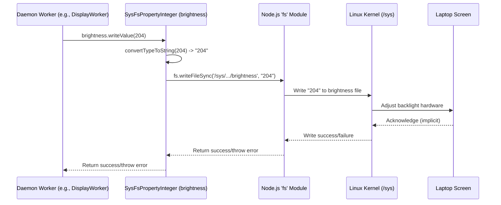

# Chapter 8: Talking to Linux - SysFsPropertyIO / SysFsController

Welcome back! In [Chapter 7: TuxedoIOAPI (Native Binding)](07_tuxedoioapi__native_binding_.md), we explored how TUXEDO Control Center (TCC) uses a special native library (`TuxedoIOAPI`) to interact with unique TUXEDO hardware features via the `tuxedo-io` kernel module.

However, Linux already provides a standard way to monitor and control many common hardware parameters, like CPU speeds, screen brightness, or fan sensor readings. This mechanism doesn't usually require special native libraries. It works through a special "virtual" filesystem called `/sys`.

This chapter explores how TCC interacts with this standard Linux interface using helper classes called `SysFsPropertyIO` and `SysFsController`. Think of these as TCC's toolkit for safely reading and writing to the system's built-in hardware control files.

## What Problem Do These Classes Solve?

Imagine Linux like a car with a very detailed dashboard, but instead of physical gauges and buttons, it has lots of text files located in a specific directory: `/sys`.

*   Want to know the current screen brightness? Read the text from `/sys/class/backlight/some_driver/actual_brightness`. It might contain the number `128`.
*   Want to set the brightness to maximum? Find the maximum value by reading `/sys/class/backlight/some_driver/max_brightness` (let's say it's `255`), then write the text `255` into the `/sys/class/backlight/some_driver/brightness` file.
*   Want to see which CPU speed modes ("governors") are available? Read `/sys/devices/system/cpu/cpu0/cpufreq/scaling_available_governors`. It might contain text like `powersave performance schedutil`.

While this is powerful, interacting with these files directly in code can be messy:

1.  **Raw Text:** You always read and write plain text, even for numbers or on/off switches. You need to constantly convert between text and the data type you actually want (like a number for brightness or a boolean for an on/off state).
2.  **Error Prone:** What if the file doesn't exist (e.g., the hardware isn't present)? What if you don't have permission to read or write? Handling these errors manually for every single file interaction adds a lot of repetitive code.
3.  **Structure:** A single piece of hardware (like the CPU) might have many related control files in `/sys`. How do you organize access to all of them cleanly?

`SysFsPropertyIO` and `SysFsController` solve these problems by providing a **structured and safe way** to work with `/sys` files.

*   `SysFsPropertyIO<T>` handles **one specific property** (like brightness), taking care of file access, error checking, and converting data between text and the desired type `<T>` (e.g., `number`, `boolean`, `string[]`).
*   `SysFsController` groups **multiple related `SysFsPropertyIO` objects** together for a specific device (like a `CpuController` managing all CPU-related `/sys` files).

**Use Case Example:** The TCC daemon ([TuxedoControlCenterDaemon (tccd)](04_tuxedocontrolcenterdaemon__tccd_.md)) needs to apply the screen brightness setting defined in the currently active [TccProfile (Performance Profiles)](01_tccprofile__performance_profiles_.md). Instead of manually finding the right `/sys` file, opening it, converting the profile's brightness percentage to the correct scale (0-255 usually), writing the text value, and handling potential errors, it uses a `DisplayBacklightController` (a type of `SysFsController`) which has a `brightness` property (a `SysFsPropertyInteger`). The daemon simply calls `displayController.brightness.writeValue(newValue)` and the helper classes handle the details.

## Key Concepts

Let's break down these tools:

*   **`/sys` Filesystem:** Think of it as a window into the kernel's view of your hardware. It's not real files on your disk, but appears that way. Reading from a file shows a current hardware status or setting. Writing to a file often *changes* a hardware setting. Accessing these files usually requires root privileges, which the `tccd` daemon has.

*   **`SysFsPropertyIO<T>` (The Smart File Handler):**
    *   **Purpose:** Manages interaction with *one* specific hardware property exposed via `/sys`.
    *   **Type Parameter `<T>`:** You specify what kind of data this property represents (e.g., `SysFsPropertyIO<number>` for brightness, `SysFsPropertyIO<boolean>` for an on/off switch, `SysFsPropertyIO<string[]>` for a list of available options).
    *   **Paths:** It knows the file path for reading (`readPath`) and writing (`writePath`), which are often the same. Example: `new SysFsPropertyInteger('/sys/.../actual_brightness', '/sys/.../brightness')`.
    *   **Conversion:** It automatically handles converting the text read from the file into the type `<T>` (using `convertStringToType`) and converting a value of type `<T>` back into text before writing (using `convertTypeToString`).
    *   **Operations:** Provides simple methods like `readValue()` (read and convert), `writeValue(value: T)` (convert and write), `readValueNT()` (read but return `undefined` instead of throwing an error if reading fails), `isAvailable()` (check if the file exists and is readable), `isWritable()` (check write permission).

*   **Specific Implementations (e.g., `SysFsPropertyInteger`, `SysFsPropertyBoolean`):**
    *   These are ready-to-use classes that extend `SysFsPropertyIO<T>` for common data types.
    *   `SysFsPropertyInteger`: Handles reading/writing whole numbers (uses `parseInt` and `toString`).
    *   `SysFsPropertyBoolean`: Handles reading/writing on/off states (converts text '1'/'0' to `true`/`false`).
    *   `SysFsPropertyString`: Handles reading/writing plain strings.
    *   `SysFsPropertyStringList`: Handles space-separated lists of strings (like available CPU governors).
    *   `SysFsPropertyNumList`: Handles comma-separated lists of numbers, including ranges (like '0-7,10').

*   **`SysFsController` (The Device Manager):**
    *   **Purpose:** Acts as a container or manager for all the `SysFsPropertyIO` objects related to a single device (like the CPU, display backlight, etc.).
    *   **Structure:** A class like `CpuController` or `DisplayBacklightController` extends `SysFsController`. Inside its constructor, it creates instances of the specific `SysFsPropertyIO` types it needs, passing them the correct `/sys` paths for that device.
    *   **Helpers:** Often includes methods to find the correct device paths (e.g., `/sys/class/backlight` might contain multiple drivers, the controller finds the active one) or to apply settings across multiple properties easily.

## Solving the Use Case (Setting Screen Brightness)

Let's see how TCC uses these tools to set the screen brightness:

1.  **Daemon Gets Request:** A worker inside the `tccd` daemon (e.g., `DisplayWorker`) receives the target brightness value (let's say `80%`) from the active profile.
2.  **Identify Device:** The worker first needs to find the correct backlight device. It might use a helper method (like `SysFsController.getDeviceList('/sys/class/backlight')`) to find available drivers (e.g., `intel_backlight`, `amdgpu_bl0`). Let's say it finds `intel_backlight`.
3.  **Create Controller:** The worker creates an instance of `DisplayBacklightController`, passing it the base path and driver name:
    ```typescript
    // Simplified inside DisplayWorker
    const driverName = 'intel_backlight'; // Found earlier
    const basePath = '/sys/class/backlight';
    const displayController = new DisplayBacklightController(basePath, driverName);
    ```
4.  **Access Properties:** The `displayController` object now holds ready-to-use properties like `brightness` and `maxBrightness` (which are instances of `SysFsPropertyInteger`).
5.  **Read Max Brightness:** To convert the 80% value to the system's scale, the worker reads the maximum value:
    ```typescript
    // Simplified inside DisplayWorker
    const max = displayController.maxBrightness.readValueNT(); // Read max value (e.g., 255)
    if (max === undefined) { /* Handle error: can't read max brightness */ return; }
    ```
    *Behind the scenes, `readValueNT` reads the text from `/sys/class/backlight/intel_backlight/max_brightness`, parses it as an integer, and returns it (or `undefined` on error).*
6.  **Calculate Value:** The worker calculates the value to write: `const valueToWrite = Math.round(max * (80 / 100));` (e.g., `Math.round(255 * 0.8) = 204`).
7.  **Write Brightness:** The worker tells the controller's property to write the new value:
    ```typescript
    // Simplified inside DisplayWorker
    try {
        displayController.brightness.writeValue(valueToWrite); // Write the calculated value (e.g., 204)
    } catch (err) {
        // Handle error: failed to write brightness
    }
    ```
    *Behind the scenes, `writeValue(204)` converts the number `204` to the string `"204"` and writes it to the file `/sys/class/backlight/intel_backlight/brightness` using Node.js `fs.writeFileSync`. The kernel reacts to this file write by actually changing the screen brightness.*

Using the `SysFsController` and `SysFsPropertyIO` makes the worker code much cleaner and more robust compared to manual file handling.

## Under the Hood: Reading and Writing via `fs`

Let's peek at how `SysFsPropertyIO` works internally.

### Write Flow Diagram



*This diagram shows the `writeValue` call. The property converts the number to a string, then uses the Node.js `fs` module to write that string to the appropriate `/sys` file. The kernel intercepts this write and changes the hardware setting.*

### Code Snippets

Let's look at the code provided earlier.

**1. The Base Class: `SysFsPropertyIO<T>`**

This abstract class defines the core logic for reading, writing, and checking availability.

```typescript
// Simplified from src/common/classes/SysFsPropertyIO.ts
import * as fs from 'fs';
import { promises as fsp} from 'fs'; // Async file system access

export abstract class SysFsPropertyIO<T> {

    constructor(readonly readPath: string, readonly writePath: string = readPath) {}

    // Subclasses MUST implement these to convert types
    protected abstract convertStringToType(value: string): T;
    protected abstract convertTypeToString(value: T): string;

    /** Reads value, throws error on failure. */
    public readValue(): T {
        try {
            // Read file content as text
            // highlight-next-line
            const readValue: string = fs.readFileSync(this.readPath).toString();
            // Convert text to the specific type T
            // highlight-next-line
            return this.convertStringToType(readValue);
        } catch (err) {
            throw Error(`Could not read ${this.readPath}: ${err}`);
        }
    }

    /** Reads value, returns undefined on failure. */
    public readValueNT(): T {
        try {
            // Same logic as readValue, but catches the error
            return this.readValue();
        } catch (err) {
            return undefined;
        }
    }

    /** Writes value, throws error on failure. */
    public writeValue(value: T) {
        // Convert the value of type T to text
        // highlight-next-line
        const stringValue = this.convertTypeToString(value);
        try {
            // Check if the write path exists first
            if (!fs.existsSync(this.writePath)) {
                throw Error(`File not found: ${this.writePath}`);
            }
            // Write the text value to the file
            // highlight-next-line
            fs.writeFileSync(this.writePath, stringValue);
        } catch (err) {
            throw Error(`Could not write '${stringValue}' to ${this.writePath}: ${err}`);
        }
    }

    /** Checks if read/write paths exist and are readable */
    public isAvailable(): boolean {
        try {
            // Check existence first
            if (fs.existsSync(this.readPath) && fs.existsSync(this.writePath)) {
                // Try reading to ensure basic access
                fs.readFileSync(this.readPath);
                return true;
            }
            return false;
        } catch (err) {
            return false; // Any error means not available
        }
    }

    /** Check if property is writable */
    public isWritable(): boolean {
        try {
            // Use accessSync to check for write permissions
            // highlight-next-line
            fs.accessSync(this.writePath, fs.constants.W_OK);
            return true;
        } catch (err) {
            return false;
        }
    }

    // ... async versions (readValueA, writeValueA) and other helpers omitted ...
}
```

*This base class uses Node.js's `fs.readFileSync`, `fs.writeFileSync`, `fs.existsSync`, and `fs.accessSync` to interact with the files specified by `readPath` and `writePath`. It relies on the abstract `convertStringToType` and `convertTypeToString` methods, which must be implemented by subclasses like `SysFsPropertyInteger`.*

**2. A Concrete Implementation: `SysFsPropertyInteger`**

This class extends `SysFsPropertyIO<number>` and implements the conversion methods for integers.

```typescript
// Simplified from src/common/classes/SysFsProperties.ts
import { SysFsPropertyIO } from './SysFsPropertyIO';

export class SysFsPropertyInteger extends SysFsPropertyIO<number> {

    // Convert the string read from file to a number
    convertStringToType(value: string): number {
        // highlight-next-line
        return parseInt(value, 10); // Use standard parseInt
    }

    // Convert the number value back to a string for writing
    convertTypeToString(value: number): string {
        // highlight-next-line
        return value.toString(10); // Use standard toString
    }
}
```

*This is very straightforward. `convertStringToType` uses the standard JavaScript `parseInt()` function, and `convertTypeToString` uses the standard `.toString()` method for numbers.* Other implementations like `SysFsPropertyBoolean` or `SysFsPropertyStringList` have slightly more complex conversion logic.

**3. A Controller Example: `DisplayBacklightController`**

This class groups the properties needed to control screen backlight.

```typescript
// Simplified from src/common/classes/DisplayBacklightController.ts
import * as path from 'path';
import { SysFsPropertyInteger } from './SysFsProperties';
import { SysFsController } from './SysFsController';

export class DisplayBacklightController extends SysFsController {

    // Properties are created in the constructor based on paths
    readonly brightness: SysFsPropertyInteger;
    readonly maxBrightness: SysFsPropertyInteger;

    constructor(public readonly basePath: string, public readonly driver: string) {
        super(); // Call base class constructor

        // Construct the full paths to the sysfs files
        const driverPath = path.join(this.basePath, this.driver);
        const actualBrightnessPath = path.join(driverPath, 'actual_brightness');
        const brightnessPath = path.join(driverPath, 'brightness');
        const maxBrightnessPath = path.join(driverPath, 'max_brightness');

        // Create the property instances
        // highlight-start
        this.brightness = new SysFsPropertyInteger(actualBrightnessPath, brightnessPath);
        this.maxBrightness = new SysFsPropertyInteger(maxBrightnessPath); // Read-only, so only readPath needed
        // highlight-end

        // Note: Original code has a workaround for amdgpu_bl driver, simplified here.
    }
}
```

*The `DisplayBacklightController` takes the base path (e.g., `/sys/class/backlight`) and the specific driver directory (e.g., `intel_backlight`) found on the system. It then creates instances of `SysFsPropertyInteger` for `brightness` (using separate read/write paths) and `maxBrightness` (using only a read path), storing them as properties of the controller object.*

**4. Controller Base Class: `SysFsController`**

This provides common helper functions, like listing devices.

```typescript
// Simplified from src/common/classes/SysFsController.ts
import * as fs from 'fs';

export abstract class SysFsController {

    /** Gets a list of directory/file names in a given path */
    public static getDeviceList(sourceDir: string): string[] {
        try {
            // Read the directory contents
            // highlight-next-line
            const entries = fs.readdirSync(sourceDir, { withFileTypes: true });
            // Return just the names
            // highlight-next-line
            return entries.map(dirent => dirent.name);
        } catch (err) {
            // Return empty list if directory doesn't exist or isn't readable
            return [];
        }
    }

    // ... other helpers like getDeviceListDirent might exist ...
}
```

*This base class offers static utility methods like `getDeviceList` that use `fs.readdirSync` to help find available devices or drivers within a specific `/sys` directory.*

**5. Usage in a Worker (Conceptual)**

A daemon worker would use the controller and its properties.

```typescript
// Conceptual example within a theoretical DisplayWorker class
import { DisplayBacklightController } from '../../common/classes/DisplayBacklightController';
import { SysFsController } from '../../common/classes/SysFsController';

class DisplayWorker /* extends DaemonWorker */ {
    private displayController: DisplayBacklightController;

    public onStart(): void {
        // Find the correct backlight driver (e.g., the first one found)
        const drivers = SysFsController.getDeviceList('/sys/class/backlight');
        if (drivers.length > 0) {
            // highlight-next-line
            this.displayController = new DisplayBacklightController('/sys/class/backlight', drivers[0]);
            console.log('Display controller initialized for:', drivers[0]);
        } else {
            console.error('No backlight device found!');
        }
    }

    public applyBrightness(percent: number): void {
        if (!this.displayController || !this.displayController.maxBrightness.isAvailable()) {
            console.error('Display controller not ready or max brightness unreadable.');
            return;
        }

        // Read max brightness using the property
        // highlight-next-line
        const max = this.displayController.maxBrightness.readValueNT();
        if (max === undefined) return; // Error handled by readValueNT

        // Calculate and write the new brightness value
        const valueToWrite = Math.round(max * (percent / 100));
        try {
            // highlight-next-line
            this.displayController.brightness.writeValue(valueToWrite);
            console.log(`Brightness set to ${valueToWrite} (${percent}%)`);
        } catch (err) {
            console.error(`Failed to set brightness: ${err}`);
        }
    }
}
```

*This conceptual worker shows how it might find a backlight driver in `onStart` using `SysFsController.getDeviceList` and create the `DisplayBacklightController`. The `applyBrightness` method then uses the controller's `maxBrightness` and `brightness` properties (`SysFsPropertyInteger` instances) to read the maximum value and write the new calculated brightness, letting the helper classes handle the file I/O and conversions.*

## Conclusion

The `SysFsPropertyIO` and `SysFsController` classes are TCC's standard toolkit for interacting with the Linux `/sys` filesystem. They provide a clean, robust, and type-safe abstraction over raw file operations.

You've learned:

*   `/sys` exposes hardware parameters as files.
*   `SysFsPropertyIO<T>` manages reading, writing, and type conversion for a single `/sys` file/property.
*   Specific classes like `SysFsPropertyInteger` handle common data types.
*   `SysFsController` groups related properties for a specific hardware device (e.g., `DisplayBacklightController`, `CpuController`).
*   These classes simplify the code within the TCC daemon workers by handling file access, error checking, and data conversion details.

These tools allow TCC to reliably control standard Linux hardware features alongside the TUXEDO-specific ones managed by the [TuxedoIOAPI (Native Binding)](07_tuxedoioapi__native_binding_.md).

Now that we've seen the main ways `tccd` interacts with hardware (`TuxedoIOAPI` and `SysFs`), how is the work organized *inside* the daemon? How does it manage applying profile settings, monitoring sensors, and reacting to events concurrently? In the next chapter, we'll look at the structure provided by [DaemonWorker / DaemonListener](09_daemonworker___daemonlistener.md).

---

Generated by [AI Codebase Knowledge Builder](https://github.com/The-Pocket/Tutorial-Codebase-Knowledge)