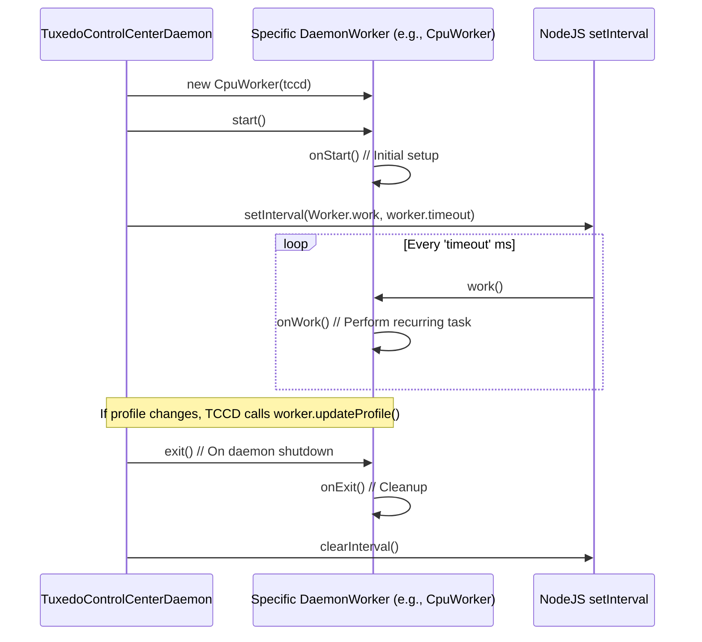
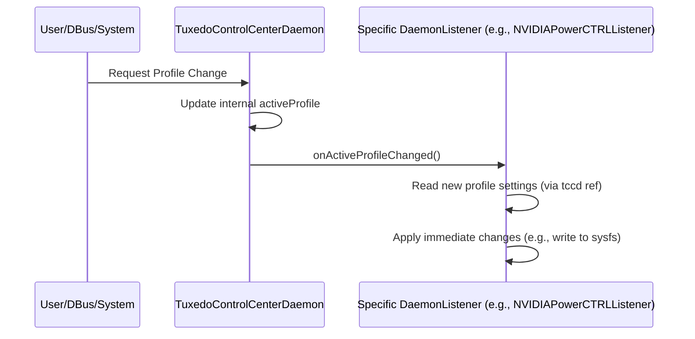

# Chapter 9: DaemonWorker / DaemonListener

Welcome back! In [Chapter 8: Talking to Linux - SysFsPropertyIO / SysFsController](08_sysfspropertyio___sysfscontroller.md), we learned how TUXEDO Control Center (TCC) uses helper classes to read and write standard hardware settings through the Linux `/sys` filesystem. Combined with the [TuxedoIOAPI (Native Binding)](07_tuxedoioapi__native_binding_.md) for special TUXEDO features, we now have a good idea of *how* the background daemon (`tccd`) interacts with hardware.

But the [TuxedoControlCenterDaemon (tccd)](04_tuxedocontrolcenterdaemon__tccd_.md) has many jobs to do simultaneously! It needs to:
*   Regularly check CPU temperature.
*   Adjust fan speeds based on temperature curves.
*   Monitor battery status.
*   Apply profile settings when the active profile changes.
*   Listen for keyboard backlight key presses.
*   ...and more!

How does `tccd` keep all these tasks organized without becoming a tangled mess? This chapter introduces the organizational structure it uses: **DaemonWorker** and **DaemonListener**.

## What Problem Do These Classes Solve?

Imagine the `tccd` daemon is like a busy office manager. It has several distinct responsibilities related to managing the laptop's hardware. Doing everything in one giant piece of code would be confusing and hard to maintain.

TCC uses a modular design based on two types of "employees":

1.  **`DaemonWorker`:** Think of this as a dedicated employee who performs a specific, **recurring task** at regular intervals. For example:
    *   One worker's job is to check the CPU temperature every second (`FanControlWorker`).
    *   Another worker's job is to check the current screen brightness every few seconds and save it if needed (`DisplayBacklightWorker`).
    *   Yet another worker might apply CPU settings based on the current profile (`CpuWorker`).

2.  **`DaemonListener`:** Think of this as an employee who **waits for a specific event** to happen and then reacts accordingly. They aren't working on a fixed schedule, but rather respond when something specific occurs. For example:
    *   One listener waits for the *active performance profile* to change. When it does, this listener applies settings specific to that profile (like NVIDIA power offsets in `NVIDIAPowerCTRLListener`).
    *   Another listener might wait for a keyboard backlight brightness key press and react by changing the backlight level (`KeyboardBacklightListener`).

This separation of concerns keeps the `tccd` code organized, making it easier to understand, modify, and add new features. Each worker or listener focuses on one specific job related to a hardware component or system event.

**Use Case Example:** When you switch from the "Office" profile to the "High Performance" profile:
*   The `tccd` daemon detects this change.
*   It tells all relevant `DaemonWorker` instances (like `CpuWorker`, `FanControlWorker`) which profile is now active. The next time their `onWork` runs, they will use the new profile's settings.
*   It *also* immediately calls the `onActiveProfileChanged` method on all `DaemonListener` instances. A listener like `NVIDIAPowerCTRLListener` might instantly apply a power offset specific to the "High Performance" profile.

## Key Concepts

Let's look closer at these two structures.

### `DaemonWorker` (The Scheduled Employee)

*   **Purpose:** To perform a specific task repeatedly at a defined interval.
*   **Core Structure:** Defined by the abstract class `DaemonWorker` (`src/service-app/classes/DaemonWorker.ts`).
*   **Key Properties:**
    *   `timeout`: How often (in milliseconds) the worker's main task should run. This is set when the worker is created (e.g., `super(1000, tccd)` means run every 1000ms or 1 second).
    *   `tccd`: A reference back to the main `tccd` daemon instance, allowing the worker to access shared data (like the currently active profile) and configuration.
    *   `activeProfile`: Stores the profile that the worker should currently be using for its settings.
*   **Key Methods (Implemented by specific workers):**
    *   `onStart()`: Code that runs **once** when the `tccd` daemon starts up. Used for initial setup specific to this worker (e.g., checking hardware compatibility, setting initial states).
    *   `onWork()`: The main task code that runs **repeatedly** every `timeout` milliseconds. This is where the worker monitors sensors, calculates adjustments, or applies settings based on the `activeProfile`.
    *   `onExit()`: Code that runs **once** when the `tccd` daemon is shutting down. Used for cleanup (e.g., resetting hardware to a safe default state).
*   **Management by `tccd`:**
    1.  When `tccd` starts, it creates instances of all necessary workers (e.g., `new CpuWorker(this)`, `new FanControlWorker(this)`).
    2.  It calls the `start()` method on each worker, which in turn calls the worker's `onStart()` implementation.
    3.  It sets up a JavaScript `setInterval` timer for each worker, calling the worker's `work()` method (which calls `onWork()`) every `timeout` milliseconds.
    4.  When the active profile changes, `tccd` calls the `updateProfile(newProfile)` method on each worker to inform it of the change.

### `DaemonListener` (The Event Responder)

*   **Purpose:** To react to specific events happening within the `tccd` daemon or the system.
*   **Core Structure:** Defined by the abstract class `DaemonListener` (`src/service-app/classes/DaemonListener.ts`).
*   **Key Properties:**
    *   `tccd`: A reference back to the main `tccd` daemon instance, allowing the listener to access shared data and configuration.
*   **Key Methods (Implemented by specific listeners):**
    *   `onActiveProfileChanged()`: Code that runs **immediately** whenever the active performance profile is changed within `tccd`. Used to apply settings that need to react instantly to a profile switch.
    *   *(Other methods could exist for other types of events, like `onKeyboardKeyPress(key)` or `onACStatusChanged(isPluggedIn)`, though `onActiveProfileChanged` is the main one shown in the provided code).*
*   **Management by `tccd`:**
    1.  When `tccd` starts, it creates instances of all necessary listeners (e.g., `new NVIDIAPowerCTRLListener(this)`).
    2.  Listeners often perform some initial setup in their constructor (`init()` method).
    3.  When a relevant event occurs (e.g., `tccd` determines the active profile has changed), `tccd` loops through its list of listeners and calls the corresponding method (e.g., `listener.onActiveProfileChanged()`) on each one.

## How Workers and Listeners Solve the Use Case (Profile Switch)

Let's revisit the profile switch from "Office" to "High Performance".

1.  **Event:** `tccd` receives a request (likely via [DBus Communication](05_dbus_communication__tccdbusservice___tccdbuscontroller_.md)) to activate the "High Performance" profile.
2.  **`tccd` Updates State:** The main daemon code updates its internal record of the active profile to "High Performance".
3.  **Notify Workers:** `tccd` calls `worker.updateProfile(highPerfProfile)` for all workers (like `CpuWorker`, `FanControlWorker`, `DisplayBacklightWorker`). The workers now know which profile to use next time their `onWork` runs.
4.  **Notify Listeners:** `tccd` calls `listener.onActiveProfileChanged()` for all listeners (like `NVIDIAPowerCTRLListener`).
5.  **Listener Reacts Immediately:** `NVIDIAPowerCTRLListener.onActiveProfileChanged()` executes:
    *   It reads the `nvidiaPowerCTRLProfile.cTGPOffset` value from the `highPerfProfile` object (passed via the `tccd` reference).
    *   It uses its `SysFsPropertyInteger` instance (`ctgpOffsetSysfsProp`) to immediately write this offset value to the `/sys/devices/platform/tuxedo_nvidia_power_ctrl/ctgp_offset` file (using the tools from [Chapter 8](08_sysfspropertyio___sysfscontroller.md)).
6.  **Workers Act on Schedule:** A short time later (when their `setInterval` timer fires):
    *   `CpuWorker.onWork()` might run. It checks if the current CPU settings match the `highPerfProfile`. If not, it applies them (e.g., sets the 'performance' governor, higher frequency limits) using its `CpuController`.
    *   `FanControlWorker.onWork()` runs. It reads current temperatures. Based on the fan curve defined in the `highPerfProfile`, it calculates the required fan speed and sets it using the [TuxedoIOAPI](07_tuxedoioapi__native_binding_.md) or sysfs methods.

This combination ensures both immediate reactions (Listeners) and regular monitoring/adjustments (Workers) happen in an organized way.

## Under the Hood: Lifecycle and Code

Let's look at the structure and some simplified code.

### Worker Lifecycle Diagram


*This shows `tccd` creating a worker, calling its `start()` method once, and then setting up a timer to call `work()` repeatedly. On shutdown, `exit()` is called.*

### Listener Event Handling Diagram


*This shows an event triggering `tccd` to update its state and then immediately notify the relevant listener by calling its event handler method.*

### Code Snippets

**1. `DaemonWorker` Abstract Class (`src/service-app/classes/DaemonWorker.ts`)**

This defines the blueprint for all workers.

```typescript
// Simplified from src/service-app/classes/DaemonWorker.ts
import { ITccProfile } from '../../common/models/TccProfile';
import { TuxedoControlCenterDaemon } from './TuxedoControlCenterDaemon';

export abstract class DaemonWorker {

    constructor(
        // highlight-next-line
        public readonly timeout: number, // How often onWork() runs (ms)
        protected tccd: TuxedoControlCenterDaemon // Access to main daemon
    ) {}

    public timer: NodeJS.Timer; // Holds the interval timer

    protected activeProfile: ITccProfile; // Current profile for settings

    // Methods subclasses MUST implement
    // highlight-start
    protected abstract onStart(): void; // Run once at start
    protected abstract onWork(): void;  // Run repeatedly
    protected abstract onExit(): void;  // Run once at exit
    // highlight-end

    // Public wrappers called by tccd
    public start(): void { this.triggerWork(this.onStart); }
    public work(): void { this.triggerWork(this.onWork); }
    public exit(): void { this.triggerWork(this.onExit); }

    // Called by tccd when the active profile changes
    public updateProfile(activeProfile: ITccProfile): void {
        this.activeProfile = activeProfile;
    }

    // Helper to ensure previousProfile is updated after work
    private triggerWork(eventFunction: () => void): void {
        eventFunction.call(this);
        // this.previousProfile = this.activeProfile; // Logic for previous profile omitted
    }
}
```
*This abstract class defines the core structure: the constructor takes the `timeout` and `tccd` reference, and it declares the `onStart`, `onWork`, and `onExit` methods that concrete workers must provide.*

**2. Example Worker: `DisplayBacklightWorker` (`src/service-app/classes/DisplayBacklightWorker.ts`)**

A concrete worker managing screen brightness.

```typescript
// Simplified from src/service-app/classes/DisplayBacklightWorker.ts
import { DaemonWorker } from './DaemonWorker';
import { DisplayBacklightController } from '../../common/classes/DisplayBacklightController';
import { TuxedoControlCenterDaemon } from './TuxedoControlCenterDaemon';
import { SysFsController } from '../../common/classes/SysFsController'; // For getDeviceList

export class DisplayBacklightWorker extends DaemonWorker {
    private controllers: DisplayBacklightController[] = [];
    private basePath = '/sys/class/backlight';

    constructor(tccd: TuxedoControlCenterDaemon) {
        // highlight-next-line
        super(3000, tccd); // Run onWork every 3000ms (3 seconds)
    }

    // Helper to find available backlight drivers
    private findDrivers(): void {
        const displayDrivers = SysFsController.getDeviceList(this.basePath);
        this.controllers = [];
        displayDrivers.forEach((driverName) => {
            this.controllers.push(new DisplayBacklightController(this.basePath, driverName));
        });
    }

    // Called once when tccd starts
    // highlight-next-line
    protected onStart(): void {
        // Determine initial brightness based on profile or saved value
        let brightnessPercent = 100; // Default
        const currentProfile = this.activeProfile;
        if (currentProfile?.display?.useBrightness && currentProfile.display.brightness !== undefined) {
            brightnessPercent = currentProfile.display.brightness;
        } else if (this.tccd.autosave.displayBrightness !== undefined) {
            brightnessPercent = this.tccd.autosave.displayBrightness;
        }
        // Apply the initial brightness
        this.writeBrightness(brightnessPercent);
    }

    // Called every 3 seconds
    // highlight-next-line
    protected onWork(): void {
        this.findDrivers(); // Check for drivers again (they might change)

        // Read current brightness and potentially save it to autosave config
        for (const controller of this.controllers) {
            try {
                const value = controller.brightness.readValueNT(); // Read current value
                const max = controller.maxBrightness.readValueNT(); // Read max value
                if (value !== undefined && max !== undefined && max > 0 && value !== 0) {
                    // Save the current brightness percentage
                    this.tccd.autosave.displayBrightness = Math.round((value * 100) / max);
                }
            } catch (err) {
                this.tccd.logLine('DisplayBacklightWorker Error reading: ' + err);
            }
        }
    }

    // Called once when tccd stops
    // highlight-next-line
    protected onExit(): void {
        // Maybe save the final brightness value before exiting
        // (Implementation details omitted)
    }

    // Helper to write brightness to all found controllers
    private writeBrightness(brightnessPercent: number): void {
        this.findDrivers();
        for (const controller of this.controllers) {
            try {
                const max = controller.maxBrightness.readValueNT();
                if (max === undefined) continue;
                const valueToWrite = Math.round((brightnessPercent * max) / 100);
                controller.brightness.writeValue(valueToWrite); // Use SysFsPropertyInteger
            } catch (err) {
                this.tccd.logLine('Failed to set brightness on ' + controller.driver);
            }
        }
    }
}
```
*This worker extends `DaemonWorker`. It sets a 3-second timeout. `onStart` applies the initial brightness based on the profile or saved state. `onWork` periodically reads the current brightness and updates the saved value. `onExit` might do final cleanup. It uses `DisplayBacklightController` (from [Chapter 8](08_sysfspropertyio___sysfscontroller.md)) to interact with sysfs.*

**3. `DaemonListener` Abstract Class (`src/service-app/classes/DaemonListener.ts`)**

This defines the blueprint for all listeners.

```typescript
// Simplified from src/service-app/classes/DaemonListener.ts
import { TuxedoControlCenterDaemon } from './TuxedoControlCenterDaemon';

export abstract class DaemonListener {
    constructor(protected tccd: TuxedoControlCenterDaemon) {} // Access to main daemon

    // Method subclasses MUST implement to react to profile changes
    // highlight-next-line
    public abstract onActiveProfileChanged(): void;

    // Other potential event handlers could be added here
}
```
*This abstract class is simpler. It mainly requires subclasses to implement the `onActiveProfileChanged` method.*

**4. Example Listener: `NVIDIAPowerCTRLListener` (`src/service-app/classes/NVIDIAPowerCTRLListener.ts`)**

A concrete listener reacting to profile changes to set NVIDIA power offsets.

```typescript
// Simplified from src/service-app/classes/NVIDIAPowerCTRLListener.ts
import { DaemonListener } from "./DaemonListener";
import { TuxedoControlCenterDaemon } from './TuxedoControlCenterDaemon';
import { SysFsPropertyInteger } from "../../common/classes/SysFsProperties";

export class NVIDIAPowerCTRLListener extends DaemonListener {
    // Path to the sysfs file for NVIDIA cTGP offset
    private ctgpOffsetPath: string = "/sys/devices/platform/tuxedo_nvidia_power_ctrl/ctgp_offset";
    // SysFs helper for this specific file
    // highlight-next-line
    private ctgpOffsetSysfsProp: SysFsPropertyInteger = new SysFsPropertyInteger(this.ctgpOffsetPath);
    private available: boolean = false;

    constructor(tccd: TuxedoControlCenterDaemon) {
        super(tccd);
        this.available = this.ctgpOffsetSysfsProp.isAvailable(); // Check if the sysfs file exists
        if (this.available) {
            this.applyActiveProfile(); // Apply setting for the initial profile
            // ... (init code for monitoring file changes omitted) ...
        }
    }

    // Called by tccd immediately when the active profile changes
    // highlight-next-line
    public onActiveProfileChanged(): void {
        if (!this.available) {
            return; // Do nothing if hardware/sysfs file not found
        }
        // Apply the setting from the *new* active profile
        this.applyActiveProfile();
    }

    // Helper function to apply the setting
    private applyActiveProfile(): void {
        // Get the cTGP offset from the currently active profile (stored in tccd)
        let ctgpOffset: number = 0; // Default to 0
        if (this.tccd.activeProfile?.nvidiaPowerCTRLProfile?.cTGPOffset !== undefined) {
            ctgpOffset = this.tccd.activeProfile.nvidiaPowerCTRLProfile.cTGPOffset;
        }

        // Write the value using the SysFs helper
        try {
            // highlight-next-line
            this.ctgpOffsetSysfsProp.writeValue(ctgpOffset);
        } catch (err) {
            this.tccd.logLine("NVIDIAPowerCTRLListener: Failed to write cTGP offset: " + err);
        }
    }
}
```
*This listener extends `DaemonListener`. In its constructor, it checks if the required sysfs file exists using `SysFsPropertyInteger` and applies the initial value. The core logic is in `onActiveProfileChanged`: when called by `tccd`, it reads the `cTGPOffset` value from the new `this.tccd.activeProfile` and immediately writes it to the sysfs file.*

## Conclusion

The `DaemonWorker` and `DaemonListener` classes provide a vital organizational structure within the TUXEDO Control Center daemon (`tccd`).

*   **`DaemonWorker`** handles tasks that need to run repeatedly on a schedule, like monitoring sensors or applying settings gradually (`FanControlWorker`, `CpuWorker`).
*   **`DaemonListener`** handles tasks that need to react immediately to specific events, like a change in the active performance profile (`NVIDIAPowerCTRLListener`).

This modular approach keeps the complex operations of the `tccd` daemon manageable, separating different concerns into dedicated "employees" that focus on specific jobs.

We've now covered the core components of TCC, from profiles and the UI to the daemon, communication methods, hardware interaction, and internal organization. The final piece of the puzzle is how all this code is built, packaged, and installed on your system. In the next chapter, we'll look at the [Build System & Packaging](10_build_system___packaging.md).

---

Generated by [AI Codebase Knowledge Builder](https://github.com/The-Pocket/Tutorial-Codebase-Knowledge)