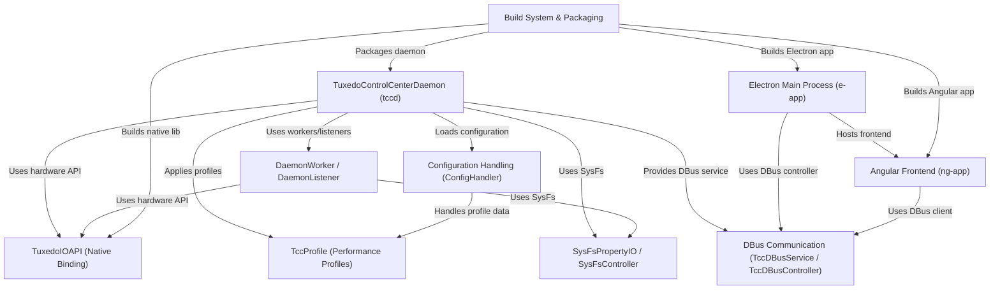

# Tutorial: tuxedo-control-center

TUXEDO Control Center (TCC) lets you **manage** your TUXEDO laptop's *special hardware features*.
It runs a background service (**tccd**) to control things like performance profiles, fan speeds, and keyboard lights, even when the main window is closed.
A graphical user interface allows you to monitor sensors and change settings easily.

**Source Repository:** [https://github.com/martinhoang/tuxedo-control-center.git](https://github.com/martinhoang/tuxedo-control-center.git)

## Chapters

1. [TccProfile (Performance Profiles)](01_tccprofile__performance_profiles_.md)
2. [Angular Frontend (ng-app)](02_angular_frontend__ng_app_.md)
3. [Electron Main Process (e-app)](03_electron_main_process__e_app_.md)
4. [TuxedoControlCenterDaemon (tccd)](04_tuxedocontrolcenterdaemon__tccd_.md)
5. [DBus Communication (TccDBusService / TccDBusController)](05_dbus_communication__tccdbusservice___tccdbuscontroller_.md)
6. [Configuration Handling (ConfigHandler)](06_configuration_handling__confighandler_.md)
7. [TuxedoIOAPI (Native Binding)](07_tuxedoioapi__native_binding_.md)
8. [SysFsPropertyIO / SysFsController](08_sysfspropertyio___sysfscontroller.md)
9. [DaemonWorker / DaemonListener](09_daemonworker___daemonlistener.md)
10. [Build System & Packaging](10_build_system___packaging.md)

---

Generated by [AI Codebase Knowledge Builder](https://github.com/The-Pocket/Tutorial-Codebase-Knowledge)